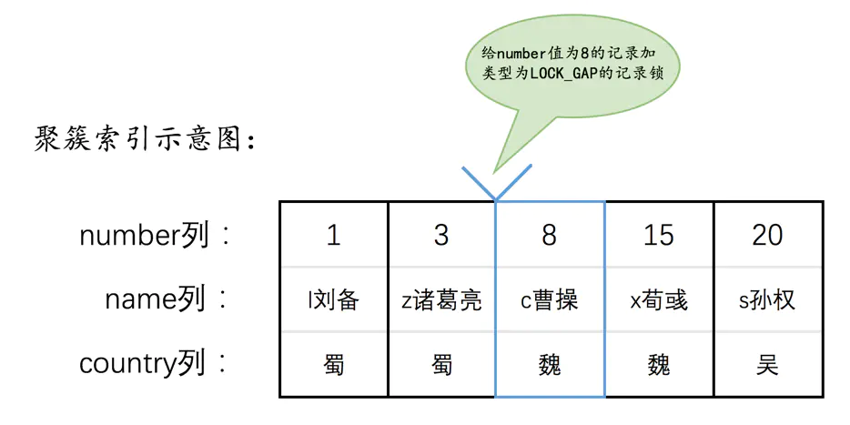
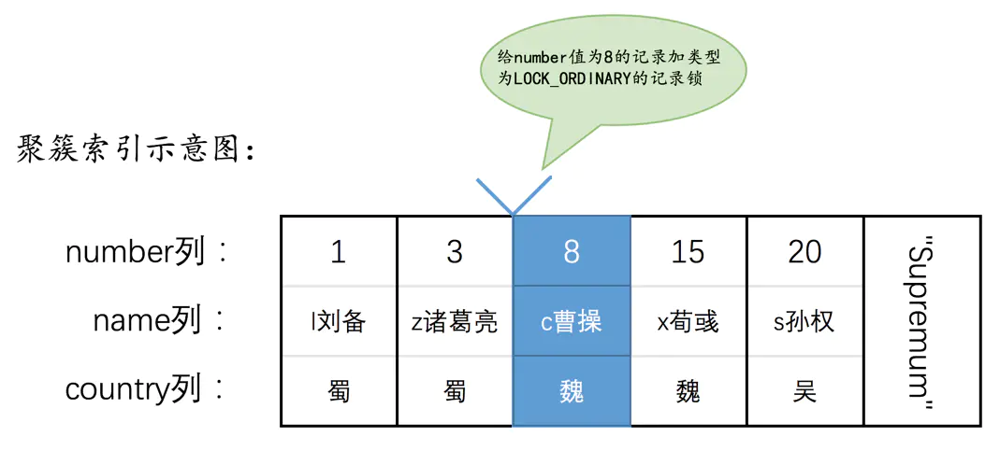
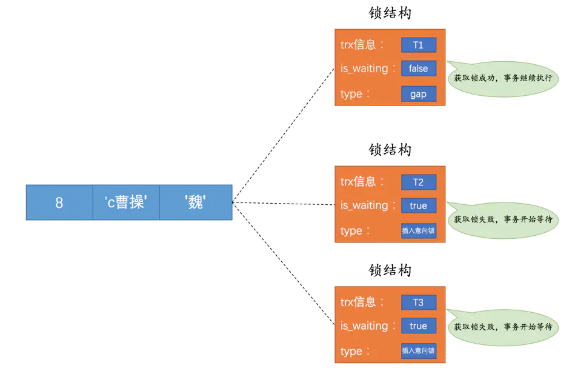
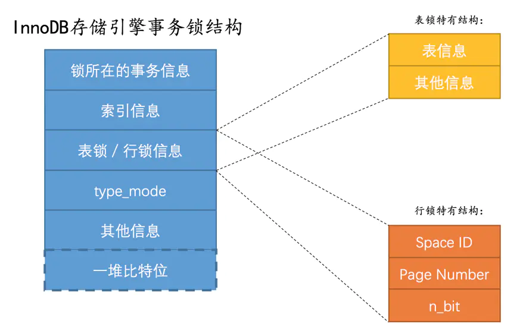

[toc]

# 字符集和比较规则

待更新...

# B+树索引

## InnoDB中的索引方案

InnoDB是使用页来作为管理存储空间的基本单位，也就是最多能保证16KB的连续存储空间。

InnoDB可以灵活管理所有目录项。**目录项**其实长得跟我们的用户记录差不多，只不过目录项中的两个列是**主键和页号**而已，所以他们复用了之前存储用户记录的数据页来存储目录项，为了和用户记录做一下区分，我们把这些用来表示目录项的记录称为目录项记录。那InnoDB怎么区分一条记录是普通的用户记录还是目录项记录呢？别忘了记录头信息里的record_type属性，它的各个取值代表的意思如下：

- 0：普通的用户记录
- 1：目录项记录
- 2：最小记录
- 3：最大记录

使用到的目录项放到数据页中的样子就是这样：


目录项记录中只存储主键值和对应的页号，比用户记录需要的存储空间小多了，但是不论怎么说一个页只有16KB大小，能存放的目录项记录也是有限的，那如果表中的数据太多，以至于一个数据页不足以存放所有的目录项记录。


不论是存放用户记录的数据页，还是存放目录项记录的数据页，我们都把它们存放到**B+**树这个数据结构中了，所以我们也称这些数据页为节点。从图中可以看出来，我们的**实际用户记录其实都存放在B+树的最底层的节点上**，这些节点也被称为**叶子节点**或**叶节点**，其余用来存放**目录项**的节点称为**非叶子节点**或者**内节点**，其中**B+**树最上边的那个节点也称为**根节点**。


假设所有存放用户记录的叶子节点代表的数据页可以存放100条用户记录，所有存放目录项记录的内节点代表的数据页可以存放1000条目录项记录，那么：

- 如果B+树只有1层，也就是只有1个用于存放用户记录的节点，最多能存放100条记录。

- 如果B+树有2层，最多能存放1000×100=100000条记录。

- 如果B+树有3层，最多能存放1000×1000×100=100000000条记录。

- 如果B+树有4层，最多能存放1000×1000×1000×100=100000000000条记录。哇咔咔～这么多的记录！！！

### 聚簇索引

B+树本身就是一个目录，或者说本身就是一个索引。它有两个特点：

1. 使用记录主键值的大小进行记录和页的排序，这包括三个方面的含义：

   - 页内的记录是按照主键的大小顺序排成一个单向链表。

   - 各个存放用户记录的页也是根据页中用户记录的主键大小顺序排成一个双向链表。

   - 存放目录项记录的页分为不同的层次，在同一层次中的页也是根据页中目录项记录的主键大小顺序排成一个双向链表。

1. B+树的**叶子节点**存储的是完整的用户记录。

   - 所谓完整的用户记录，就是指这个记录中存储了所有列的值（包括隐藏列）。

我们把具有这两种特性的B+树称为聚簇索引，所有完整的用户记录都存放在这个聚簇索引的叶子节点处。这种聚簇索引并不需要我们在MySQL语句中显式的使用INDEX语句去创建（后边会介绍索引相关的语句），InnoDB存储引擎会自动的为我们创建聚簇索引。

另外，在InnoDB存储引擎中，聚簇索引就是数据的存储方式（所有的用户记录都存储在了叶子节点），也就是所谓的索引即数据，数据即索引。

### 二级索引

上边介绍的聚簇索引只能在搜索条件是主键值时才能发挥作用，因为B+树中的数据都是按照主键进行排序的。

不同的B+树中的数据采用不同的排序规则。比方说我们用c2列的大小作为数据页、页中记录的排序规则，再建一棵B+树，效果如下图所示：


这个B+树与上边介绍的聚簇索引有几处不同：

- 使用记录c2列的大小进行记录和页的排序，这包括三个方面的含义：

  - 页内的记录是按照c2列的大小顺序排成一个单向链表。

  - 各个存放用户记录的页也是根据页中记录的c2列大小顺序排成一个双向链表。

  - 存放目录项记录的页分为不同的层次，在同一层次中的页也是根据页中目录项记录的c2列大小顺序排成一个双向链表。

- B+树的叶子节点存储的并不是完整的用户记录，而只是c2列+主键这两个列的值。

- 目录项记录中不再是**主键+页号**的搭配，而变成了**c2列+页号**的搭配。

但是这个B+树的叶子节点中的记录只存储了c2和c1（也就是主键）两个列，所以**我们必须再根据主键值去聚簇索引中再查找一遍完整的用户记录**。

我们根据这个以c2列大小排序的B+树只能确定我们要查找记录的主键值，所以如果我们想根据c2列的值查找到完整的用户记录的话，仍然需要到**聚簇索引**中再查一遍，这个过程也被称为**回表**。也就是根据c2列的值查询一条完整的用户记录需要使用到2棵B+树！！！

由于我们使用的是c2列的大小作为B+树的排序规则，所以我们也称这个B+树为为c2列建立的索引。

### 联合索引

可以同时以多个列的大小作为排序规则，也就是同时为多个列建立索引，比方说我们想让B+树按照c2和c3列的大小进行排序，这个包含两层含义：

- 先把各个记录和页按照c2列进行排序。

- 在记录的c2列相同的情况下，采用c3列进行排序。

为c2和c3列建立的索引的示意图如下：


如图所示，我们需要注意一下几点：

- 每条目录项记录都由c2、c3、页号这三个部分组成，各条记录先按照c2列的值进行排序，如果记录的c2列相同，则按照c3列的值进行排序。

- B+树叶子节点处的用户记录由c2、c3和主键c1列组成。

以c2和c3列的大小为排序规则建立的B+树称为联合索引，本质上也是一个二级索引。它的意思与分别为c2和c3列分别建立索引的表述是不同的，不同点如下：

- 建立联合索引只会建立如上图一样的1棵B+树。

- 为c2和c3列分别建立索引会分别以c2和c3列的大小为排序规则建立2棵B+树。

## InnoDB的B+树索引的注意事项

### 根页面万年不动窝

我们前边介绍B+树索引的时候，为了大家理解上的方便，先把存储用户记录的叶子节点都画出来，然后接着画存储目录项记录的内节点，实际上B+树的形成过程是这样的：

- 每当为某个表创建一个B+树索引（聚簇索引不是人为创建的，默认就有）的时候，都会为这个索引创建一个**根节点页面**。最开始表中没有数据的时候，每个B+树索引对应的根节点中既没有用户记录，也没有目录项记录。

- 随后向表中插入用户记录时，先把用户记录存储到这个**根节点**中。

- 当**根节点**中的可用空间用完时继续插入记录，此时会将根节点中的所有记录复制到一个新分配的页，比如页a中，然后对这个新页进行**页分裂**的操作，得到另一个新页，比如页b。这时新插入的记录根据键值（也就是聚簇索引中的主键值，二级索引中对应的索引列的值）的大小就会被分配到**页a**或者**页b**中，而**根节点**便升级为存储**目录项**记录的页。

这个过程需要大家特别注意的是：**一个B+树索引的根节点自诞生之日起，便不会再移动**。这样只要我们对某个表建立一个索引，那么它的根节点的页号便会被记录到某个地方，然后凡是InnoDB存储引擎需要用到这个索引的时候，都会从那个固定的地方取出根节点的页号，从而来访问这个索引。

这个存储某个索引的根节点在哪个页面中的信息就是传说中的数据字典中的一项信息。

### 内节点中目录项记录的唯一性

如果二级索引中目录项记录的内容只是索引列 + 页号的搭配的话，那么为c2列建立索引后的B+树应该长这样：


如果我们想新插入一行记录，其中c1、c2、c3的值分别是：9、1、'c'，那么在修改这个为c2列建立的二级索引对应的B+树时便碰到了个大问题：由于页3中存储的目录项记录是由c2列 + 页号的值构成的，页3中的两条目录项记录对应的c2列的值都是1，而我们新插入的这条记录的c2列的值也是1，那我们这条新插入的记录到底应该放到页4中，还是应该放到页5中啊？

为了让新插入记录能找到自己在那个页里，我们需要保证在B+树的同一层内节点的目录项记录除页号这个字段以外是唯一的。所以对于二级索引的内节点的目录项记录的内容实际上是由三个部分构成的：

- 索引列的值

- 主键值

- 页号

也就是我们把主键值也添加到二级索引内节点中的目录项记录了，这样就能保证B+树每一层节点中各条目录项记录除页号这个字段外是唯一的，所以我们为c2列建立二级索引后的示意图实际上应该是这样子的：


这样我们再插入记录(9, 1, 'c')时，由于页3中存储的目录项记录是由c2列 + 主键 + 页号的值构成的，可以先把新记录的c2列的值和页3中各目录项记录的c2列的值作比较，如果c2列的值相同的话，可以接着比较主键值，因为B+树同一层中不同目录项记录的c2列 + 主键的值肯定是不一样的，所以最后肯定能定位唯一的一条目录项记录，在本例中最后确定新记录应该被插入到页5中。

### 一个页面最少存储2条记录

一个B+树只需要很少的层级就可以轻松存储数亿条记录，为什么查询速度杠杠的？

这是因为B+树本质上就是一个大的多层级目录，每经过一个目录时都会过滤掉许多无效的子目录，直到最后访问到存储真实数据的目录。

那如果一个大的目录中只存放一个子目录是个啥效果呢？那就是目录层级非常非常非常多，而且最后的那个存放真实数据的目录中只能存放一条记录。费了半天劲只能存放一条真实的用户记录？逗我呢？所以InnoDB的一个数据页至少可以存放两条记录。

## MyISAM中的索引方案

我们知道InnoDB中索引即数据，也就是聚簇索引的那棵B+树的叶子节点中已经把所有完整的用户记录都包含了，而MyISAM的索引方案虽然也使用树形结构，但是却将索引和数据分开存储：

- 将表中的记录按照记录的插入顺序单独存储在一个文件中，称之为数据文件。这个文件并不划分为若干个数据页，有多少记录就往这个文件中塞多少记录就成了。我们可以通过行号而快速访问到一条记录。由于在插入数据的时候并没有刻意按照主键大小排序，所以我们并不能在这些数据上使用二分法进行查找。

- 使用MyISAM存储引擎的表会把索引信息另外存储到一个称为索引文件的另一个文件中。MyISAM会单独为表的主键创建一个索引，只不过在索引的叶子节点中存储的不是完整的用户记录，而是主键值 + 行号的组合。也就是先通过索引找到对应的行号，再通过行号去找对应的记录！
  
  这一点和InnoDB是完全不相同的，在InnoDB存储引擎中，我们只需要根据主键值对聚簇索引进行一次查找就能找到对应的记录，而在MyISAM中却需要进行一次回表操作，意味着**MyISAM中建立的索引相当于全部都是二级索引**！

- 如果有需要的话，我们也可以对其它的列分别建立索引或者建立联合索引，原理和InnoDB中的索引差不多，不过在叶子节点处存储的是相应的列 + 行号。这些索引也全部都是二级索引。

InnoDB中的索引即数据，数据即索引，而MyISAM中却是索引是索引、数据是数据。

## MySQL中创建和删除索引的语句

InnoDB和MyISAM会自动为主键或者声明为**UNIQUE**的列去自动建立B+树索引，但是如果我们想为其他的列建立索引就需要我们显式的去指明。

比方说我们想在创建index_demo表的时候就为c2和c3列添加一个联合索引，可以这么写建表语句：

```sql
CREATE TABLE index_demo(
    c1 INT,
    c2 INT,
    c3 CHAR(1),
    PRIMARY KEY(c1),
    INDEX idx_c2_c3 (c2, c3)
);
```

也可以在修改表结构的时候添加索引：

```sql
ALTER TABLE 表名 ADD [INDEX|KEY] 索引名;
```

在这个建表语句中我们创建的索引名是idx_c2_c3，这个名称可以随便起，不过我们还是建议以idx_为前缀，后边跟着需要建立索引的列名，多个列名之间用下划线_分隔开。

如果我们想删除这个索引，可以这么写：

```sql
ALTER TABLE index_demo DROP INDEX idx_c2_c3;
```

# B+树索引的使用

使用B+树索引的过程中需要注意的一些点：

## 索引的代价

B+树索引在空间和时间上都有代价，所以没事儿别瞎建索引。

## B+树索引适用的条件

B+树索引适用于下边这些情况：

- 全值匹配

- 匹配左边的列

- 匹配范围值

- 精确匹配某一列并范围匹配另外一列

- 用于排序

- 用于分组

## 回表的代价

需要回表的记录越多，使用二级索引的性能就越低，甚至让某些查询宁愿使用全表扫描也不使用二级索引。

### 覆盖索引

在查询列表里只包含索引列，索引得到结果后就不必到聚簇索引中再查找记录的剩余列。不鼓励用*号作为查询列表，最好把我们需要查询的列依次标明。


## 如何挑选索引

在使用索引时需要注意下边这些事项：

- 只为用于搜索、排序或分组的列创建索引

- 为列的基数大的列创建索引

- 索引列的类型尽量小

- 可以只对字符串值的前缀建立索引

- 只有索引列在比较表达式中单独出现才可以适用索引

- 为了尽可能少的让聚簇索引发生页面分裂和记录移位的情况，建议让主键拥有AUTO_INCREMENT属性。

- 定位并删除表中的重复和冗余索引

- 尽量使用覆盖索引进行查询，避免回表带来的性能损耗。

# 单表访问方法

本章针对MySQL怎么执行单表查询（就是FROM子句后边只有一个表，最简单的那种查询。对于单个表的查询来说，设计MySQL的大叔把查询的执行方式大致分为下边两种：

- 使用全表扫描进行查询

  这种执行方式很好理解，就是把表的每一行记录都扫一遍嘛，把符合搜索条件的记录加入到结果集就完了。不管是啥查询都可以使用这种方式执行，当然，这种也是最笨的执行方式。

- 使用索引进行查询

  因为直接使用全表扫描的方式执行查询要遍历好多记录，所以代价可能太大了。如果查询语句中的搜索条件可以使用到某个索引，那直接使用索引来执行查询可能会加快查询执行的时间。使用索引来执行查询的方式五花八门，又可以细分为许多种类：

  - 针对主键或唯一二级索引的等值查询

  - 针对普通二级索引的等值查询

  - 针对索引列的范围查询

  - 直接扫描整个索引

MySQL执行查询语句的方式称之为**访问方法**或者**访问类型**。同一个查询语句可能可以使用多种不同的访问方法来执行，虽然最后的查询结果都是一样的，但是执行的时间可能差远了。

## const

有的时候我们可以通过主键列来定位一条记录，比方说这个查询：

```sql
SELECT * FROM single_table WHERE id = 1438;
```


MySQL会直接利用主键值在聚簇索引中定位对应的用户记录。

B+树叶子节点中的记录是按照索引列排序的，对于的聚簇索引来说，它对应的B+树叶子节点中的记录就是按照id列排序的。B+树本来就是一个矮矮的大胖子，所以这样根据主键值定位一条记录的速度贼快。

类似的，我们根据唯一二级索引列来定位一条记录的速度也是贼快的，比如下边这个查询：

```sql
SELECT * FROM single_table WHERE key2 = 3841;
```

这个查询的执行过程的示意图就是这样：


第一步先从idx_key2对应的B+树索引中根据key2列与常数的等值比较条件定位到一条二级索引记录，然后再根据该记录的id值到聚簇索引中获取到完整的用户记录。

这种通过主键或者唯一二级索引列来定位一条记录的访问方法定义为：const，意思是常数级别的，代价是可以忽略不计的。不过这种const访问方法只能在主键列或者唯一二级索引列和一个常数进行等值比较时才有效，如果主键或者唯一二级索引是由多个列构成的话，索引中的每一个列都需要与常数进行等值比较，这个const访问方法才有效（这是因为只有该索引中全部列都采用等值比较才可以定位唯一的一条记录）。

对于唯一二级索引来说，查询该列为NULL值的情况比较特殊，比如这样：

```sql
SELECT * FROM single_table WHERE key2 IS NULL;
```

因为唯一二级索引列并不限制 NULL 值的数量，所以上述语句可能访问到多条记录，也就是说 上边这个语句不可以使用const访问方法来执行。

## ref

对某个普通的二级索引列与常数进行等值比较，比如这样：

```sql
SELECT * FROM single_table WHERE key1 = 'abc';
```

由于普通二级索引并不限制索引列值的唯一性，所以可能找到多条对应的记录，也就是说使用二级索引来执行查询的代价取决于等值匹配到的二级索引记录条数。如果匹配的记录较少，则回表的代价还是比较低的，所以MySQL可能选择使用索引而不是全表扫描的方式来执行查询。这种搜索条件为二级索引列与常数等值比较，采用二级索引来执行查询的访问方法称为：ref。


ref访问方法比const差了那么一丢丢，但是在二级索引等值比较时匹配的记录数较少时的效率还是很高的（如果匹配的二级索引记录太多那么回表的成本就太大了）。不过需要注意下边两种情况：

- 二级索引列值为NULL的情况

  不论是普通的二级索引，还是唯一二级索引，它们的索引列对包含NULL值的数量并不限制，所以我们采用key IS NULL这种形式的搜索条件最多只能使用ref的访问方法，而不是const的访问方法。

- 对于某个包含多个索引列的二级索引来说，只要是最左边的连续索引列是与常数的等值比较就可能采用ref的访问方法，比方说下边这几个查询：

```sql
SELECT * FROM single_table WHERE key_part1 = 'god like';

SELECT * FROM single_table WHERE key_part1 = 'god like' AND key_part2 = 'legendary';

SELECT * FROM single_table WHERE key_part1 = 'god like' AND key_part2 = 'legendary' AND key_part3 = 'penta kill';
```

  但是如果最左边的连续索引列并不全部是等值比较的话，它的访问方法就不能称为ref了，比方说这样：

```sql
SELECT * FROM single_table WHERE key_part1 = 'god like' AND key_part2 > 'legendary';
```

## ref_or_null

有时候我们不仅想找出某个二级索引列的值等于某个常数的记录，还想把该列的值为NULL的记录也找出来，就像下边这个查询：

```sql
SELECT * FROM single_table WHERE key1 = 'abc' OR key1 IS NULL;
```

当使用二级索引而不是全表扫描的方式执行该查询时，这种类型的查询使用的访问方法就称为ref_or_null，这个ref_or_null访问方法的执行过程如下：


可以看到，上边的查询相当于先分别从idx_key1索引对应的B+树中找出key1 IS NULL和key1 = 'abc'的两个连续的记录范围，然后根据这些二级索引记录中的id值再回表查找完整的用户记录。

## range

面对的搜索条件更复杂，比如下边这个查询：

```sql
SELECT * FROM single_table WHERE key2 IN (1438, 6328) OR (key2 >= 38 AND key2 <= 79);
```

我们当然还可以使用全表扫描的方式来执行这个查询，不过也可以使用二级索引 + 回表的方式执行，如果采用二级索引 + 回表的方式来执行的话，那么此时的搜索条件就不只是要求索引列与常数的等值匹配了，而是索引列需要匹配某个或某些范围的值，在本查询中key2列的值只要匹配下列3个范围中的任何一个就算是匹配成功了：

- key2的值是1438

- key2的值是6328

- key2的值在38和79之间。

设计MySQL的大叔把这种利用索引进行范围匹配的访问方法称之为：range。（此处所说的使用索引进行范围匹配中的**索引**可以是聚簇索引，也可以是二级索引。）

我们可以把那种索引列等值匹配的情况称之为单点区间，上边所说的范围1和范围2都可以被称为单点区间，像范围3这种的我们可以称为连续范围区间。

## index

```sql
SELECT key_part1, key_part2, key_part3 FROM single_table WHERE key_part2 = 'abc';
```

由于key_part2并不是联合索引idx_key_part最左索引列，所以我们无法使用ref或者range访问方法来执行这个语句。但是这个查询符合下边这两个条件：

- 它的查询列表只有3个列：key_part1, key_part2, key_part3，而索引idx_key_part又包含这三个列。

- 搜索条件中只有key_part2列。这个列也包含在索引idx_key_part中。

也就是说我们可以直接通过遍历idx_key_part索引的叶子节点的记录来比较key_part2 = 'abc'这个条件是否成立，把匹配成功的二级索引记录的key_part1, key_part2, key_part3列的值直接加到结果集中就行了。由于二级索引记录比聚簇索记录小的多（聚簇索引记录要存储所有用户定义的列以及所谓的隐藏列，而二级索引记录只需要存放索引列和主键），而且这个过程也不用进行回表操作，所以直接遍历二级索引比直接遍历聚簇索引的成本要小很多，就把这种采用遍历二级索引记录的执行方式称之为：index。

## all

最直接的查询执行方式就是我们已经提了无数遍的全表扫描，对于InnoDB表来说也就是直接扫描聚簇索引，把这种使用全表扫描执行查询的方式称之为：all。

## 注意事项

### 明确range访问方法使用的范围区间

对于B+树索引来说，只要索引列和常数使用=、<=>、IN、NOT IN、IS NULL、IS NOT NULL、>、<、>=、<=、BETWEEN、!=（不等于也可以写成<>）或者LIKE操作符连接起来，就可以产生一个所谓的区间。（LIKE操作符比较特殊，只有在匹配完整字符串或者匹配字符串前缀时才可以利用索引。IN操作符的效果和若干个等值匹配操作符`=`之间用`OR`连接起来是一样的，也就是说会产生多个单点区间）

### 所有搜索条件都可以使用某个索引的情况

### 有的搜索条件无法使用索引的情况

### 复杂搜索条件下找出范围匹配的区间

## 索引合并

MySQL在一般情况下执行一个查询时最多只会用到单个二级索引，但在些特殊情况下也可能在一个查询中使用到多个二级索引，这种使用到多个索引来完成一次查询的执行方法称之为：index merge，具体的索引合并算法有下边三种。

### Intersection合并

```sql
SELECT * FROM single_table WHERE key1 = 'a' AND key3 = 'b';
```

假设这个查询使用Intersection合并的方式执行的话，那这个过程就是这样的：

- 从idx_key1二级索引对应的B+树中取出key1 = 'a'的相关记录。

- 从idx_key3二级索引对应的B+树中取出key3 = 'b'的相关记录。

- 二级索引的记录都是由索引列 + 主键构成的，所以我们可以计算出这两个结果集中id值的交集。

- 按照上一步生成的id值列表进行回表操作，也就是从聚簇索引中把指定id值的完整用户记录取出来，返回给用户。

MySQL在某些特定的情况下才可能会使用到Intersection索引合并，满足条件总结就是：

- 根据二级索引查询出的结果集是按照主键值排序的。

### Union合并

### Sort-Union合并

### 联合索引替代Intersection索引合并

```sql
ALTER TABLE single_table drop index idx_key1, idx_key3, add index idx_key1_key3(key1, key3);
```

# 基于成本的优化

## 单表查询的成本

MySQL中一条查询语句的执行成本是由I/O成本和CPU成本这两个方面组成的。

对于InnoDB存储引擎来说，页是磁盘和内存之间交互的基本单位，MySQL规定读取一个页面花费的成本默认是1.0，读取以及检测一条记录是否符合搜索条件的成本默认是0.2。1.0、0.2这些数字称之为成本常数，这两个成本常数我们最常用到。需要注意的是，不管读取记录时需不需要检测是否满足搜索条件，其成本都算是0.2。

### 1. 根据搜索条件，找出所有可能使用的索引

我们前边说过，对于B+树索引来说，只要索引列和常数使用=、<=>、IN、NOT IN、IS NULL、IS NOT NULL、>、<、>=、<=、BETWEEN、!=（不等于也可以写成<>）或者LIKE操作符连接起来，就可以产生一个所谓的范围区间（LIKE匹配字符串前缀也行），也就是说这些搜索条件都可能使用到索引，设计MySQL的大叔把一个查询中可能使用到的索引称之为**possible keys**。

我们分析一下上边查询中涉及到的几个搜索条件：

- key1 IN ('a', 'b', 'c')，这个搜索条件可以使用二级索引idx_key1。

- key2 > 10 AND key2 < 1000，这个搜索条件可以使用二级索引idx_key2。

- key3 > key2，这个搜索条件的索引列由于没有和常数比较，所以并不能使用到索引。

- key_part1 LIKE '%hello%'，key_part1通过LIKE操作符和以通配符开头的字符串做比较，不可以适用索引。

- common_field = '123'，由于该列上压根儿没有索引，所以不会用到索引。

综上所述，上边的查询语句可能用到的索引，也就是possible keys只有idx_key1和idx_key2。

### 2. 计算全表扫描的代价

对于InnoDB存储引擎来说，全表扫描的意思就是把聚簇索引中的记录都依次和给定的搜索条件做一下比较，把符合搜索条件的记录加入到结果集，所以需要将聚簇索引对应的页面加载到内存中，然后再检测记录是否符合搜索条件。由于查询成本=I/O成本+CPU成本，所以计算全表扫描的代价需要两个信息：

- 聚簇索引占用的页面数

- 该表中的记录数

这两个信息从哪来呢？MySQL为每个表维护了一系列的统计信息，提供了SHOW TABLE STATUS语句来查看表的统计信息，如果要看指定的某个表的统计信息，在该语句后加对应的LIKE语句。

```sql
mysql> SHOW TABLE STATUS LIKE 'single_table'\G
*************************** 1. row ***************************
           Name: single_table
         Engine: InnoDB
        Version: 10
     Row_format: Dynamic
           Rows: 9693
 Avg_row_length: 163
    Data_length: 1589248
Max_data_length: 0
   Index_length: 2752512
      Data_free: 4194304
 Auto_increment: 10001
    Create_time: 2018-12-10 13:37:23
    Update_time: 2018-12-10 13:38:03
     Check_time: NULL
      Collation: utf8_general_ci
       Checksum: NULL
 Create_options:
        Comment:
1 row in set (0.01 sec)
```

### 3. 计算使用不同索引执行查询的代价

- 范围区间数量

- 回表次数

#### 是否有可能使用索引合并（Index Merge）

本例中有关key1和key2的搜索条件是使用AND连接起来的，而对于idx_key1和idx_key2都是范围查询，也就是说查找到的二级索引记录并不是按照主键值进行排序的，并不满足使用Intersection索引合并的条件，所以并不会使用索引合并。

### 4. 对比各种执行方案的代价，找出成本最低的那一个

下边把执行本例中的查询的各种可执行方案以及它们对应的成本列出来：

- 全表扫描的成本：2037.7

- 使用idx_key2的成本：134.01

- 使用idx_key1的成本：168.21

很显然，使用idx_key2的成本最低，所以当然选择idx_key2来执行查询喽。

## 基于索引统计数据的成本计算

```sql
SELECT * FROM single_table WHERE key1 IN ('aa1', 'aa2', 'aa3', ... , 'zzz');
```

计算方式我们上边已经介绍过了，就是先获取索引对应的B+树的**区间最左记录**和**区间最右记录**，然后再计算这两条记录之间有多少记录（记录条数少的时候可以做到精确计算，多的时候只能估算）。MySQL把这种通过直接访问索引对应的B+树来计算某个范围区间对应的索引记录条数的方式称之为**index dive**。

MySQL的大叔把这种通过直接访问索引对应的B+树来计算某个范围区间对应的索引记录条数的方式称之为index dive。

**index dive**就是直接利用索引对应的B+树来计算某个范围区间对应的记录条数。

MySQL的查询优化器为了计算这些单点区间对应的索引记录条数，要进行20000次index dive操作，这性能损耗可就大了，搞不好计算这些单点区间对应的索引记录条数的成本比直接全表扫描的成本都大了。MySQL提供了一个系统变量eq_range_index_dive_limit，表示最大index dive的次数。

```sql
mysql> SHOW VARIABLES LIKE '%dive%';
+---------------------------+-------+
| Variable_name             | Value |
+---------------------------+-------+
| eq_range_index_dive_limit | 200   |
+---------------------------+-------+
1 row in set (0.08 sec)
```

如果超过eq_range_index_dive_limit的值，就要使用所谓的索引统计数据来进行估算。

```sql
mysql> SHOW INDEX FROM single_table;
+--------------+------------+--------------+--------------+-------------+-----------+-------------+----------+--------+------+------------+---------+---------------+
| Table        | Non_unique | Key_name     | Seq_in_index | Column_name | Collation | Cardinality | Sub_part | Packed | Null | Index_type | Comment | Index_comment |
+--------------+------------+--------------+--------------+-------------+-----------+-------------+----------+--------+------+------------+---------+---------------+
| single_table |          0 | PRIMARY      |            1 | id          | A         |       9693  |     NULL | NULL   |      | BTREE      |         |               |
| single_table |          0 | idx_key2     |            1 | key2        | A         |       9693  |     NULL | NULL   | YES  | BTREE      |         |               |
| single_table |          1 | idx_key1     |            1 | key1        | A         |        968 |     NULL | NULL   | YES  | BTREE      |         |               |
| single_table |          1 | idx_key3     |            1 | key3        | A         |        799 |     NULL | NULL   | YES  | BTREE      |         |               |
| single_table |          1 | idx_key_part |            1 | key_part1   | A         |        9673 |     NULL | NULL   | YES  | BTREE      |         |               |
| single_table |          1 | idx_key_part |            2 | key_part2   | A         |        9999 |     NULL | NULL   | YES  | BTREE      |         |               |
| single_table |          1 | idx_key_part |            3 | key_part3   | A         |       10000 |     NULL | NULL   | YES  | BTREE      |         |               |
+--------------+------------+--------------+--------------+-------------+-----------+-------------+----------+--------+------+------------+---------+---------------+
7 rows in set (0.01 sec)
```

使用统计数据来计算单点区间对应的索引记录条数可比index dive的方式简单多了，但是它的致命弱点就是：不精确！。使用统计数据算出来的查询成本与实际所需的成本可能相差非常大。

在MySQL 5.7.3以及之前的版本中，eq_range_index_dive_limit的默认值为10，之后的版本默认值为200。所以如果大家采用的是5.7.3以及之前的版本的话，很容易采用索引统计数据而不是index dive的方式来计算查询成本。当你的查询中使用到了IN查询，但是却实际没有用到索引，就应该考虑一下是不是由于 eq_range_index_dive_limit 值太小导致的。

## 连接查询的成本

### Condition filtering介绍

MySQL中连接查询采用的是嵌套循环连接算法，驱动表会被访问一次，被驱动表可能会被访问多次，所以对于两表连接查询来说，它的查询成本由下边两个部分构成：

- 单次查询驱动表的成本

- 多次查询被驱动表的成本（具体查询多少次取决于对驱动表查询的结果集中有多少条记录）

我们把对驱动表进行查询后得到的记录条数称之为驱动表的扇出（英文名：fanout）。很显然驱动表的扇出值越小，对被驱动表的查询次数也就越少，连接查询的总成本也就越低。当查询优化器想计算整个连接查询所使用的成本时，就需要计算出驱动表的扇出值。

在以下两种情况下计算驱动表扇出值时需要靠猜：

- 如果使用的是全表扫描的方式执行的单表查询，那么计算驱动表扇出时需要猜满足搜索条件的记录到底有多少条。

- 如果使用的是索引执行的单表扫描，那么计算驱动表扇出的时候需要猜满足除使用到对应索引的搜索条件外的其他搜索条件的记录有多少条。

MySQL把这个猜的过程称之为condition filtering。当然，这个过程可能会使用到索引，也可能使用到统计数据，也可能就是设计MySQL的大叔单纯的瞎猜。

### 两表连接的成本分析

连接查询的成本计算公式是这样的：

```txt
连接查询总成本 = 单次访问驱动表的成本 + 驱动表扇出数 * 单次访问被驱动表的成本
```

对于左（外）连接和右（外）连接查询来说，它们的驱动表是固定的，所以想要得到最优的查询方案只需要：

- 分别为驱动表和被驱动表选择成本最低的访问方法。

可是对于内连接来说，驱动表和被驱动表的位置是可以互换的，所以需要考虑两个方面的问题：

- 不同的表作为驱动表最终的查询成本可能是不同的，也就是需要考虑最优的表连接顺序。

- 然后分别为驱动表和被驱动表选择成本最低的访问方法。

计算内连接查询成本的方式更麻烦一些，下边我们就以内连接为例来看看如何计算出最优的连接查询方案。

查询优化器需要分别考虑这两种情况下的最优查询成本，然后选取那个成本更低的连接顺序以及该连接顺序下各个表的最优访问方法作为最终的查询计划。

连接查询成本占大头的其实是驱动表扇出数 x 单次访问被驱动表的成本，所以我们的优化重点其实是下边这两个部分：

- 尽量减少驱动表的扇出

- 对被驱动表的访问成本尽量低

这一点对于我们实际书写连接查询语句时十分有用，我们需要**尽量在被驱动表的连接列上建立索引**，这样就可以使用**ref**访问方法来降低访问被驱动表的成本了。如果可以，被驱动表的连接列最好是该表的主键或者唯一二级索引列，这样就可以把访问被驱动表的成本降到更低了。

### 多表连接的成本分析

有n个表进行连接，MySQL查询优化器要每一种连接顺序的成本都计算一遍么？那可是n!种连接顺序呀。其实真的是要都算一遍，不过设计MySQL的大叔们想了很多办法减少计算非常多种连接顺序的成本的方法：

- 提前结束某种顺序的成本评估

- 系统变量optimizer_search_depth

- 根据某些规则压根儿就不考虑某些连接顺序

## 调节成本常数

我们前边已经介绍了两个成本常数：

- 读取一个页面花费的成本默认是1.0

- 检测一条记录是否符合搜索条件的成本默认是0.2

其实除了这两个成本常数，MySQL还支持好多呢，它们被存储到了mysql数据库（这是一个系统数据库，我们之前介绍过）的两个表中：

```sql
mysql> SHOW TABLES FROM mysql LIKE '%cost%';
+--------------------------+
| Tables_in_mysql (%cost%) |
+--------------------------+
| engine_cost              |
| server_cost              |
+--------------------------+
2 rows in set (0.00 sec)
```

一条语句的执行其实是分为两层的：

- server层

- 存储引擎层

在server层进行连接管理、查询缓存、语法解析、查询优化等操作，在存储引擎层执行具体的数据存取操作。也就是说一条语句在server层中执行的成本是和它操作的表使用的存储引擎是没关系的，所以关于这些操作对应的**成本常数**就存储在了**server_cost表**中，而依赖于存储引擎的一些操作对应的**成本常数**就存储在了**engine_cost表**中。

# 基于规则的优化

## 查询重写

MySQL依据一些规则，竭尽全力的把糟糕的语句转换成某种可以比较高效执行的形式，这个过程也可以被称作查询重写。

- 条件化简

- 移除不必要的括号

- 常量传递（constant_propagation）

- 等值传递（equality_propagation）

- 移除没用的条件（trivial_condition_removal）

- 表达式计算

- HAVING子句和WHERE子句的合并

  如果查询语句中没有出现诸如SUM、MAX等等的聚集函数以及GROUP BY子句，优化器就把HAVING子句和WHERE子句合并起来。

- 常量表检测

## 外连接消除

内连接的驱动表和被驱动表的位置可以相互转换，而左（外）连接和右（外）连接的驱动表和被驱动表是固定的。这就导致内连接可能通过优化表的连接顺序来降低整体的查询成本，而外连接却无法优化表的连接顺序。

外连接和内连接的本质区别就是：对于外连接的驱动表的记录来说，如果无法在被驱动表中找到匹配ON子句中的过滤条件的记录，那么该记录仍然会被加入到结果集中，对应的被驱动表记录的各个字段使用NULL值填充；而内连接的驱动表的记录如果无法在被驱动表中找到匹配ON子句中的过滤条件的记录，那么该记录会被舍弃。

```sql
mysql> SELECT * FROM t1 LEFT JOIN t2 ON t1.m1 = t2.m2;
+------+------+------+------+
| m1   | n1   | m2   | n2   |
+------+------+------+------+
|    2 | b    |    2 | b    |
|    3 | c    |    3 | c    |
|    1 | a    | NULL | NULL |
+------+------+------+------+
3 rows in set (0.00 sec)

mysql> SELECT * FROM t1 LEFT JOIN t2 ON t1.m1 = t2.m2 WHERE t2.n2 IS NOT NULL;
+------+------+------+------+
| m1   | n1   | m2   | n2   |
+------+------+------+------+
|    2 | b    |    2 | b    |
|    3 | c    |    3 | c    |
+------+------+------+------+
2 rows in set (0.01 sec)
```

```sql
mysql> SELECT * FROM t1 LEFT JOIN t2 ON t1.m1 = t2.m2 WHERE t2.m2 = 2;
+------+------+------+------+
| m1   | n1   | m2   | n2   |
+------+------+------+------+
|    2 | b    |    2 | b    |
+------+------+------+------+
1 row in set (0.00 sec)

mysql> SELECT * FROM t1 INNER JOIN t2 ON t1.m1 = t2.m2 WHERE t2.m2 = 2;
+------+------+------+------+
| m1   | n1   | m2   | n2   |
+------+------+------+------+
|    2 | b    |    2 | b    |
+------+------+------+------+
1 row in set (0.00 sec)
```

我们把这种在外连接查询中，指定的WHERE子句中包含被驱动表中的列不为NULL值的条件称之为空值拒绝（英文名：reject-NULL）。在被驱动表的WHERE子句符合空值拒绝的条件后，外连接和内连接可以相互转换。这种转换带来的好处就是查询优化器可以通过评估表的不同连接顺序的成本，选出成本最低的那种连接顺序来执行查询。

## 子查询优化

### 子查询语法

- SELECT子句中

```sql
SELECT (SELECT m1 FROM t1 LIMIT 1);
```

- FROM子句中

```sql
SELECT m, n FROM (SELECT m2 + 1 AS m, n2 AS n FROM t2 WHERE m2 > 2) AS t;
```

MySQL把这种由子查询结果集组成的表称之为派生表。

- WHERE或ON子句中

```sql
SELECT * FROM t1 WHERE m1 IN (SELECT m2 FROM t2);
```

- ORDER BY子句中

- GROUP BY子句中

#### 按返回的结果集区分子查询

- 标量子查询

```sql
SELECT (SELECT m1 FROM t1 LIMIT 1);
SELECT * FROM t1 WHERE m1 = (SELECT MIN(m2) FROM t2);
```

- 行子查询

```sql
SELECT * FROM t1 WHERE (m1, n1) = (SELECT m2, n2 FROM t2 LIMIT 1);
```

- 表子查询

```sql
SELECT * FROM t1 WHERE (m1, n1) IN (SELECT m2, n2 FROM t2);
```

#### 按与外层查询关系来区分子查询

- 不相关子查询

- 相关子查询

```sql
SELECT * FROM t1 WHERE m1 IN (SELECT m2 FROM t2 WHERE n1 = n2);
```

#### 子查询在布尔表达式中的使用

- 使用=、>、<、>=、<=、<>、!=、<=>作为布尔表达式的操作符

这里的子查询只能是标量子查询或者行子查询，也就是子查询的结果只能返回一个单一的值或者只能是一条记录。

```sql
SELECT * FROM t1 WHERE m1 < (SELECT MIN(m2) FROM t2);
SELECT * FROM t1 WHERE (m1, n1) = (SELECT m2, n2 FROM t2 LIMIT 1);
```

- [NOT] IN/ANY/SOME/ALL子查询

  - IN或者NOT IN

    ```sql
    SELECT * FROM t1 WHERE (m1, n1) IN (SELECT m2, n2 FROM t2);
    ```

  - ANY/SOME

    ```sql
    SELECT * FROM t1 WHERE m1 > ANY(SELECT m2 FROM t2);
    SELECT * FROM t1 WHERE m1 > (SELECT MIN(m2) FROM t2);
    ```

    **=ANY**相当于判断子查询结果集中是否存在某个值和给定的操作数相等，它的含义和IN是相同的。

  - ALL

    ```sql
    SELECT * FROM t1 WHERE m1 > ALL(SELECT m2 FROM t2);
    SELECT * FROM t1 WHERE m1 > (SELECT MAX(m2) FROM t2);
    ```

- EXISTS子查询

有的时候我们仅仅需要判断子查询的结果集中是否有记录，而不在乎它的记录具体是个啥，可以使用把EXISTS或者NOT EXISTS放在子查询语句前边，就像这样：

```sql
SELECT * FROM t1 WHERE EXISTS (SELECT 1 FROM t2);
```

**此部分后续待更新...**

# Explain详解

参见原书...

# Optimizer Trace

参见原书...

# InnoDB 的 Buffer Pool

## InnoDB的Buffer Pool

### Buffer Pool内部组成

Buffer Pool中默认的缓存页大小和在磁盘上默认的页大小是一样的，都是16KB。控制块和缓存页是一一对应的，它们都被存放到 Buffer Pool 中，其中控制块被存放到 Buffer Pool 的前边，缓存页被存放到 Buffer Pool 后边，所以整个Buffer Pool对应的内存空间看起来就是这样的：


### free链表的管理

把所有空闲的缓存页对应的控制块作为一个节点放到一个链表中，这个链表也可以被称作free链表（或者说空闲链表）。


### 缓存页的哈希处理

是根据**表空间号 + 页号**来定位一个**页**的，也就相当于**表空间号 + 页号是一个key，缓存页就是对应的value**，所以我们可以用表空间号 + 页号作为key，缓存页作为value创建一个哈希表，在需要访问某个页的数据时，先从哈希表中根据表空间号 + 页号看看有没有对应的缓存页，如果有，直接使用该缓存页就好，如果没有，那就从free链表中选一个空闲的缓存页，然后把磁盘中对应的页加载到该缓存页的位置。

### flush链表的管理

如果我们修改了Buffer Pool中某个缓存页的数据，那它就和磁盘上的页不一致了，这样的缓存页也被称为脏页（英文名：dirty page）。修改过的缓存页对应的控制块都会作为一个节点加入到一个链表中，因为这个链表节点对应的缓存页都是需要被刷新到磁盘上的，所以也叫flush链表。

### LRU链表的管理

#### 划分区域的LRU链表

可能降低Buffer Pool的两种情况：

- 加载到Buffer Pool中的页不一定被用到。

- 如果非常多的使用频率偏低的页被同时加载到Buffer Pool时，可能会把那些使用频率非常高的页从Buffer Pool中淘汰掉。

因为有这两种情况的存在，所以设计InnoDB的大叔把这个LRU链表按照一定比例分成两截，分别是：

- 一部分存储使用频率非常高的缓存页，所以这一部分链表也叫做热数据，或者称young区域。

- 另一部分存储使用频率不是很高的缓存页，所以这一部分链表也叫做冷数据，或者称old区域。


我们是按照某个比例将LRU链表分成两半的，不是某些节点固定是young区域的，某些节点固定是old区域的，随着程序的运行，某个节点所属的区域也可能发生变化。可以通过查看系统变量innodb_old_blocks_pct的值来确定old区域在LRU链表中所占的比例。

### 刷新脏页到磁盘

后台有专门的线程每隔一段时间负责把脏页刷新到磁盘，这样可以不影响用户线程处理正常的请求。主要有两种刷新路径：

- 从LRU链表的冷数据中刷新一部分页面到磁盘。

  后台线程会定时从LRU链表尾部开始扫描一些页面，扫描的页面数量可以通过系统变量innodb_lru_scan_depth来指定，如果从里边儿发现脏页，会把它们刷新到磁盘。这种刷新页面的方式被称之为BUF_FLUSH_LRU。

- 从flush链表中刷新一部分页面到磁盘。

  后台线程也会定时从flush链表中刷新一部分页面到磁盘，刷新的速率取决于当时系统是不是很繁忙。这种刷新页面的方式被称之为BUF_FLUSH_LIST。

### 多个Buffer Pool实例

Buffer Pool本质是InnoDB向操作系统申请的一块连续的内存空间，在多线程环境下，访问Buffer Pool中的各种链表都需要加锁处理啥的，在Buffer Pool特别大而且多线程并发访问特别高的情况下，单一的Buffer Pool可能会影响请求的处理速度。

所以在Buffer Pool特别大的时候，我们可以把它们拆分成若干个小的Buffer Pool，每个Buffer Pool都称为一个实例，它们都是独立的，独立的去申请内存空间，独立的管理各种链表，所以在**多线程并发访问时并不会相互影响，从而提高并发处理能力**。

我们可以在服务器启动的时候通过设置innodb_buffer_pool_instances的值来修改Buffer Pool实例的个数。


### 查看Buffer Pool的状态信息

可以用下边的命令查看Buffer Pool的状态信息：

```sql
SHOW ENGINE INNODB STATUS\G
```

# 事务

## 事务的概念

把需要保证原子性（Atomicity）、隔离性（Isolation）、一致性（Consistency）和持久性（Durability）的一个或多个数据库操作称之为一个事务（transaction）。

## MySQL中事务的语法

### 开启事务

```sql
BEGIN;

START TRANSACTION;
START TRANSACTION READ ONLY;  # 开启一个只读事务
START TRANSACTION READ ONLY, WITH CONSISTENT SNAPSHOT;  # 开启一个只读事务和一致性读
START TRANSACTION READ WRITE, WITH CONSISTENT SNAPSHOT;  # 开启一个读写事务和一致性读
```

### 提交事务

```sql
BEGIN;

UPDATE account SET balance = balance - 10 WHERE id = 1;
UPDATE account SET balance = balance + 10 WHERE id = 2;

COMMIT;
```

### 手动中止事务

```sql
BEGIN;

UPDATE account SET balance = balance - 10 WHERE id = 1;
UPDATE account SET balance = balance + 1 WHERE id = 2;

ROLLBACK;
```

### 自动提交

MySQL中有一个系统变量autocommit：

```sql
mysql> SHOW VARIABLES LIKE 'autocommit';
+---------------+-------+
| Variable_name | Value |
+---------------+-------+
| autocommit    | ON    |
+---------------+-------+
1 row in set (0.01 sec)
```

如果我们想关闭这种自动提交的功能，可以使用下边两种方法之一：

- 显式的的使用START TRANSACTION或者BEGIN语句开启一个事务。

- 这样在本次事务提交或者回滚前会暂时关闭掉自动提交的功能。

把系统变量autocommit的值设置为OFF，就像这样：

```sql
SET autocommit = OFF;
```

## 隐式提交

某些特殊的语句而导致事务提交的情况称为隐式提交，这些会导致事务隐式提交的语句包括：

- 定义或修改数据库对象的数据定义语言（Data definition language，缩写为：DDL）

  数据库对象，指的就是数据库、表、视图、存储过程等等这些东西。当我们使用CREATE、ALTER、DROP等语句去修改这些所谓的数据库对象时，就会隐式的提交前边语句所属于的事务。

```sql
BEGIN;

SELECT ... # 事务中的一条语句
UPDATE ... # 事务中的一条语句
... # 事务中的其它语句

CREATE TABLE ... # 此语句会隐式的提交前边语句所属于的事务
```

- 隐式使用或修改mysql数据库中的表

  当我们使用ALTER USER、CREATE USER、DROP USER、GRANT、RENAME USER、REVOKE、SET PASSWORD等语句时也会隐式的提交前边语句所属于的事务。

- 事务控制或关于锁定的语句

  当我们在一个事务还没提交或者回滚时就又使用START TRANSACTION或者BEGIN语句开启了另一个事务时，会隐式的提交上一个事务，比如这样：

```sql
BEGIN;

SELECT ... # 事务中的一条语句
UPDATE ... # 事务中的一条语句
... # 事务中的其它语句

BEGIN; # 此语句会隐式的提交前边语句所属于的事务
```

  或者使用LOCK TABLES、UNLOCK TABLES等关于锁定的语句也会隐式的提交前边语句所属的事务。

- 加载数据的语句

  使用LOAD DATA语句来批量往数据库中导入数据。

- 关于MySQL复制的一些语句

  使用START SLAVE、STOP SLAVE、RESET SLAVE、CHANGE MASTER TO等语句时也会隐式的提交前边语句所属的事务。

- 其它的一些语句

  使用ANALYZE TABLE、CACHE INDEX、CHECK TABLE、FLUSH、 LOAD INDEX INTO CACHE、OPTIMIZE TABLE、REPAIR TABLE、RESET等语句也会隐式的提交前边语句所属的事务。

### 保存点

```sql
mysql> SELECT * FROM account;
+----+--------+---------+
| id | name   | balance |
+----+--------+---------+
|  1 | 狗哥   |      11 |
|  2 | 猫爷   |       2 |
+----+--------+---------+
2 rows in set (0.00 sec)

mysql> BEGIN;

mysql> UPDATE account SET balance = balance - 10 WHERE id = 1;

mysql> SAVEPOINT s1;    # 一个保存点

mysql> SELECT * FROM account;
+----+--------+---------+
| id | name   | balance |
+----+--------+---------+
|  1 | 狗哥   |       1 |
|  2 | 猫爷   |       2 |
+----+--------+---------+
2 rows in set (0.00 sec)

mysql> UPDATE account SET balance = balance + 1 WHERE id = 2; # 更新错了

mysql> ROLLBACK TO s1;  # 回滚到保存点s1处

mysql> SELECT * FROM account;
+----+--------+---------+
| id | name   | balance |
+----+--------+---------+
|  1 | 狗哥   |       1 |
|  2 | 猫爷   |       2 |
+----+--------+---------+
2 rows in set (0.00 sec)
```

# redo日志

为了保证这个持久性，让已经提交了的事务对数据库中数据所做的修改永久生效，即使后来系统崩溃，在重启后也能把这种修改恢复出来。只需要把修改了哪些东西记录一下就好。

redo日志会把事务在执行过程中对数据库所做的所有修改都记录下来，在之后系统崩溃重启后可以把事务所做的任何修改都恢复出来。

redo日志既包含物理层面的意思，也包含逻辑层面的意思，具体指：

- 物理层面看，这些日志都指明了对哪个表空间的哪个页进行了修改。

- 逻辑层面看，在系统崩溃重启时，并不能直接根据这些日志里的记载，将页面内的某个偏移量处恢复成某个数据，而是需要调用一些事先准备好的函数，执行完这些函数后才可以将页面恢复成系统崩溃前的样子。

# undo 日志

undo log有两个作用：提供回滚和多个行版本控制(MVCC)。

undo log和redo log记录物理日志不一样，它是逻辑日志。可以认为**当delete一条记录时，undo log中会记录一条对应的insert记录**，反之亦然，当update一条记录时，它记录一条对应相反的update记录。

当执行rollback时，就可以从undo log中的逻辑记录读取到相应的内容并进行回滚。有时候应用到行版本控制的时候，也是通过undo log来实现的：当读取的某一行被其他事务锁定时，它可以从undo log中分析出该行记录以前的数据是什么，从而提供该行版本信息，让用户实现非锁定一致性读取。

undo log是采用段(segment)的方式来记录的，每个undo操作在记录的时候占用一个undo log segment。

另外，undo log也会产生redo log，因为undo log也要实现持久性保护。

[详细分析MySQL事务日志(redo log和undo log)](https://juejin.im/entry/5ba0a254e51d450e735e4a1f)

# 事务隔离级别和MVCC

## 事务隔离级别

### 事务并发执行遇到的问题

- 脏写（Dirty Write）
  
  一个事务修改了另一个未提交事务修改过的数据。

- 脏读（Dirty Read）
  
  一个事务读到了另一个未提交事务修改过的数据。

- 不可重复读（Non-Repeatable Read）
  
  一个事务只能读到另一个已经提交的事务修改过的数据，并且其他事务每对该数据进行一次修改并提交后，该事务都能查询得到最新值。

- 幻读（Phantom）
  
  一个事务先根据某些条件查询出一些记录，之后另一个事务又向表中插入了符合这些条件的记录，原先的事务再次按照该条件查询时，能把另一个事务插入的记录也读出来。

  那对于先前已经读到的记录，之后又读取不到这种情况，其实这相当于对每一条记录都发生了**不可重复读**的现象。**幻读**只是重点强调了读取到了之前读取没有获取到的记录。

### SQL标准中的四种隔离级别

这些问题也有轻重缓急之分，我们给这些问题按照严重性来排一下序：

```txt
脏写 > 脏读 > 不可重复读 > 幻读
```

设立一些隔离级别，隔离级别越低，越严重的问题就越可能发生。

|隔离级别|脏读|不可重复读|幻读|
|-|-|-|-|
|READ UNCOMMITTED|Possible|Possible|Possible|
|READ COMMITTED|Not Possible|Possible|Possible|
|REPEATABLE READ|Not Possible|Not Possible|Possible|
|SERIALIZABLE|Not Possible|Not Possible|Not Possible|

也就是说：

- READ UNCOMMITTED隔离级别下，可能发生脏读、不可重复读和幻读问题。

- READ COMMITTED隔离级别下，可能发生不可重复读和幻读问题，但是不可以发生脏读问题。

- REPEATABLE READ隔离级别下，可能发生幻读问题，但是不可以发生脏读和不可重复读的问题。

- SERIALIZABLE隔离级别下，各种问题都不可以发生。

脏脏写这个问题太严重了，不论是哪种隔离级别，都不允许脏写的情况发生。

MySQL在REPEATABLE READ隔离级别下，是可以禁止幻读问题的发生的。

#### 如何设置事务的隔离级别

修改事务的隔离级别：

```sql
SET [GLOBAL|SESSION] TRANSACTION ISOLATION LEVEL level;

SET GLOBAL TRANSACTION ISOLATION LEVEL SERIALIZABLE;  # 在全局范围影响
SET SESSION TRANSACTION ISOLATION LEVEL SERIALIZABLE;  # 在会话范围影响
SET TRANSACTION ISOLATION LEVEL SERIALIZABLE;  # 只对执行语句后的下一个事务产生影响
```

查看当前会话默认的隔离级别可以通过查看系统变量transaction_isolation的值来确定：

```sql
SHOW VARIABLES LIKE 'transaction_isolation';
SELECT @@transaction_isolation;
```

# MVCC原理

## 版本链

聚簇索引记录中都包含两个必要的隐藏列（row_id并不是必要的，我们创建的表中有主键或者非NULL的UNIQUE键时都不会包含row_id列）：

- trx_id：每次一个事务对某条聚簇索引记录进行改动时，都会把该事务的事务id赋值给trx_id隐藏列。

- roll_pointer：每次对某条聚簇索引记录进行改动时，都会把旧的版本写入到undo日志中，然后这个隐藏列就相当于一个指针，可以通过它来找到该记录修改前的信息。

每次对记录进行改动，都会记录一条undo日志，每条undo日志也都有一个roll_pointer属性（INSERT操作对应的undo日志没有该属性，因为该记录并没有更早的版本），可以将这些undo日志都连起来，串成一个链表，所以现在的情况就像下图一样：


对该记录每次更新后，都会将旧值放到一条undo日志中，就算是该记录的一个旧版本，随着更新次数的增多，所有的版本都会被roll_pointer属性连接成一个链表，我们把这个链表称之为版本链，**版本链的头节点就是当前记录最新的值**。另外，每个版本中还包含生成该版本时对应的事务id。

## ReadView

假如另一个事务已经修改了记录但是尚未提交，是不能直接读取最新版本的记录的，核心问题就是：需要判断一下版本链中的哪个版本是当前事务可见的。为此，InnoDB提出了一个ReadView的概念，这个ReadView中主要包含4个比较重要的内容：

- m_ids：表示在生成ReadView时当前系统中活跃的读写事务的事务id列表。

- min_trx_id：表示在生成ReadView时当前系统中活跃的读写事务中最小的事务id，也就是m_ids中的最小值。

- max_trx_id：表示生成ReadView时系统中应该分配给下一个事务的id值。

  > 注意max_trx_id并不是m_ids中的最大值，事务id是递增分配的。比方说现在有id为1，2，3这三个事务，之后id为3的事务提交了。那么一个新的读事务在生成ReadView时，m_ids就包括1和2，min_trx_id的值就是1，max_trx_id的值就是4。

- creator_trx_id：表示生成该ReadView的事务的事务id。

  > 只有在对表中的记录做改动时（执行INSERT、DELETE、UPDATE这些语句时）才会为事务分配事务id，否则在一个只读事务中的事务id值都默认为0。

有了这个ReadView，这样在访问某条记录时，只需要按照下边的步骤判断记录的某个版本是否可见：

- 如果被访问版本的trx_id属性值与ReadView中的creator_trx_id值相同，意味着当前事务在访问它自己修改过的记录，所以该版本可以被当前事务访问。

- 如果被访问版本的trx_id属性值小于ReadView中的min_trx_id值，表明生成该版本的事务在当前事务生成ReadView前已经提交，所以该版本可以被当前事务访问。

- 如果被访问版本的trx_id属性值大于或等于ReadView中的max_trx_id值，表明生成该版本的事务在当前事务生成ReadView后才开启，所以该版本不可以被当前事务访问。

- 如果被访问版本的trx_id属性值在ReadView的min_trx_id和max_trx_id之间，那就需要判断一下trx_id属性值是不是在m_ids列表中，如果在，说明创建ReadView时生成该版本的事务还是活跃的，该版本不可以被访问；如果不在，说明创建ReadView时生成该版本的事务已经被提交，该版本可以被访问。

在MySQL中，READ COMMITTED和REPEATABLE READ隔离级别的的一个非常大的区别就是它们**生成ReadView的时机不同**。

## MVCC（Multi-Version Concurrency Control ，多版本并发控制）

MVCC指的就是在使用**READ COMMITTD**、**REPEATABLE READ**这两种隔离级别的事务在执行普通的SELECT操作时访问记录的版本链的过程，这样子可以使不同事务的读-写、写-读操作并发执行，从而提升系统性能。

READ COMMITTD、REPEATABLE READ这两个隔离级别的一个很大不同就是：生成ReadView的时机不同，**READ COMMITTD在每一次进行普通SELECT操作前都会生成一个ReadView**，而**REPEATABLE READ只在第一次进行普通SELECT操作前生成一个ReadView，之后的查询操作都重复使用这个ReadView就好了**。

> 执行DELETE语句或者更新主键的UPDATE语句并不会立即把对应的记录完全从页面中删除，而是执行一个所谓的delete mark操作，相当于只是对记录打上了一个删除标志位，这主要就是为MVCC服务的，大家可以对比上边举的例子自己试想一下怎么使用。 另外，所谓的MVCC只是在我们进行普通的SEELCT查询时才生效，截止到目前我们所见的所有SELECT语句都算是普通的查询。

## 关于purge

我们说insert undo在事务提交之后就可以被释放掉了，而update undo由于还需要支持MVCC，不能立即删除掉。

为了支持MVCC，对于delete mark操作来说，仅仅是在记录上打一个删除标记，并没有真正将它删除掉。

随着系统的运行，在确定系统中包含最早产生的那个ReadView的事务不会再访问某些update undo日志以及被打了删除标记的记录后，有一个后台运行的purge线程会把它们真正的删除掉

# 锁

获取锁成功，或者加锁成功，然后就可以继续执行操作了。获取锁失败，或者加锁失败，或者没有成功的获取到锁，当前事务需要等待。


解决脏读、不可重复读、幻读这些问题有两种可选的解决方案：

- 方案一：读操作利用多版本并发控制（MVCC），写操作进行加锁。

- 方案二：读、写操作都采用加锁的方式。

采用MVCC方式的话，读-写操作彼此并不冲突，性能更高，采用加锁方式的话，读-写操作彼此需要排队执行，影响性能。一般情况下我们当然愿意采用MVCC来解决读-写操作并发执行的问题，但是业务在某些特殊情况下，要求必须采用加锁的方式执行，那也是没有办法的事。

## 一致性读（Consistent Reads）

事务利用MVCC进行的读取操作称之为一致性读，或者一致性无锁读，有的地方也称之为快照读。所有普通的SELECT语句（plain SELECT）在READ COMMITTED、REPEATABLE READ隔离级别下都算是一致性读，比方说：

```sql
SELECT * FROM t;
SELECT * FROM t1 INNER JOIN t2 ON t1.col1 = t2.col2
```

一致性读并不会对表中的任何记录做加锁操作，其他事务可以自由的对表中的记录做改动。

## 锁定读（Locking Reads）

### 共享锁和独占锁

- 对读取的记录加共享锁：

```sql
SELECT ... LOCK IN SHARE MODE;
```

- 对读取的记录加独占锁：

```sql
SELECT ... FOR UPDATE;
```

- 写操作DELETE、UPDATE、INSERT自动加独占锁或隐式锁

## 多粒度锁

- **意向共享锁**，英文名：Intention Shared Lock，简称IS锁。当事务准备在某条记录上加S锁时，需要先在表级别加一个IS锁。

- **意向独占锁**，英文名：Intention Exclusive Lock，简称IX锁。当事务准备在某条记录上加X锁时，需要先在表级别加一个IX锁。

IS、IX锁是**表级锁**，它们的提出仅仅为了在之后加表级别的S锁和X锁时可以快速判断表中的记录是否被上锁，以避免用遍历的方式来查看表中有没有上锁的记录，也就是说其实IS锁和IX锁是兼容的，IX锁和IX锁是兼容的。

## MySQL中的行锁和表锁

### InnoDB中的表级锁

- 表级别的S锁、X锁

- 表级别的IS锁、IX锁
  
  当我们在对使用InnoDB存储引擎的表的某些记录加S锁之前，那就需要先在表级别加一个IS锁，当我们在对使用InnoDB存储引擎的表的某些记录加X锁之前，那就需要先在表级别加一个IX锁。IS锁和IX锁的使命只是为了后续在加表级别的S锁和X锁时判断表中是否有已经被加锁的记录，以避免用遍历的方式来查看表中有没有上锁的记录。

- 表级别的AUTO-INC锁
  
  系统实现这种自动给AUTO_INCREMENT修饰的列递增赋值的原理主要是两个：

  - 采用AUTO-INC锁，也就是在执行插入语句时就在表级别加一个AUTO-INC锁，然后为每条待插入记录的AUTO_INCREMENT修饰的列分配递增的值，在该语句执行结束后，再把AUTO-INC锁释放掉。这样一个事务在持有AUTO-INC锁的过程中，其他事务的插入语句都要被阻塞，可以保证一个语句中分配的递增值是连续的。
  
  > AUTO-INC锁的作用范围只是单个插入语句，插入语句执行完成后，这个锁就被释放了，跟我们之前介绍的锁在事务结束时释放是不一样的。

  - 采用一个轻量级的锁，在为插入语句生成AUTO_INCREMENT修饰的列的值时获取一下这个轻量级锁，然后生成本次插入语句需要用到的AUTO_INCREMENT列的值之后，就把该轻量级锁释放掉，并不需要等到整个插入语句执行完才释放锁。

### InnoDB中的行级锁

在记录上加的锁。

#### 行锁类型

- Record Locks
  
  正经记录锁（LOCK_REC_NOT_GAP）是有S锁和X锁之分的，让我们分别称之为S型正经记录锁和X型正经记录锁，当一个事务获取了一条记录的S型正经记录锁后，其他事务也可以继续获取该记录的S型正经记录锁，但不可以继续获取X型正经记录锁；当一个事务获取了一条记录的X型正经记录锁后，其他事务既不可以继续获取该记录的S型正经记录锁，也不可以继续获取X型正经记录锁。

- Gap Locks
  
  MySQL在REPEATABLE READ隔离级别下是可以解决幻读问题的，解决方案有两种，可以使用**MVCC方案**解决，也可以采用**加锁**方案解决。Gap Locks，官方的类型名称为：LOCK_GAP。



  如图中为number值为8的记录加了gap锁，意味着不允许别的事务在number值为8的记录前边的间隙插入新记录，其实就是number列的值(3, 8)这个区间的新记录是不允许立即插入的。

  gap锁的提出仅仅是为了**防止插入幻影记录**而提出的。

- Next-Key Locks

  有时候我们既想锁住某条记录，又想阻止其他事务在该记录前边的间隙插入新记录，所以设计InnoDB的大叔们就提出了一种称之为Next-Key Locks的锁，官方的类型名称为：LOCK_ORDINARY。

  

  **next-key锁**的本质就是一个正经**记录锁**和一个**gap锁**的合体，它既能保护该条记录，又能阻止别的事务将新记录插入被保护记录前边的间隙。

- Insert Intention Locks

  我们说一个事务在插入一条记录时需要判断一下插入位置是不是被别的事务加了所谓的gap锁（next-key锁也包含gap锁，后边就不强调了），如果有的话，插入操作需要等待，直到拥有gap锁的那个事务提交。但是设计InnoDB的大叔规定事务在等待的时候也需要在内存中生成一个锁结构，表明有事务想在某个间隙中插入新记录，但是现在在等待。

  InnoDB的就把这种类型的锁命名为Insert Intention Locks，官方的类型名称为：LOCK_INSERT_INTENTION，我们也可以称为插入意向锁。

  

  插入意向锁并不会阻止别的事务继续获取该记录上任何类型的锁。

- 隐式锁
  
  一个事务对新插入的记录可以不显式的加锁（生成一个锁结构），但是由于事务id这个牛逼的东东的存在，相当于加了一个隐式锁。别的事务在对这条记录加S锁或者X锁时，由于隐式锁的存在，会先帮助当前事务生成一个锁结构，然后自己再生成一个锁结构后进入等待状态。

### InnoDB锁的内存结构

InnoDB本着勤俭节约的传统美德，决定在对不同记录加锁时，如果符合下边这些条件：

- 在同一个事务中进行加锁操作

- 被加锁的记录在同一个页面中

- 加锁的类型是一样的

- 等待状态是一样的

那么这些记录的锁就可以被放到一个锁结构中。


