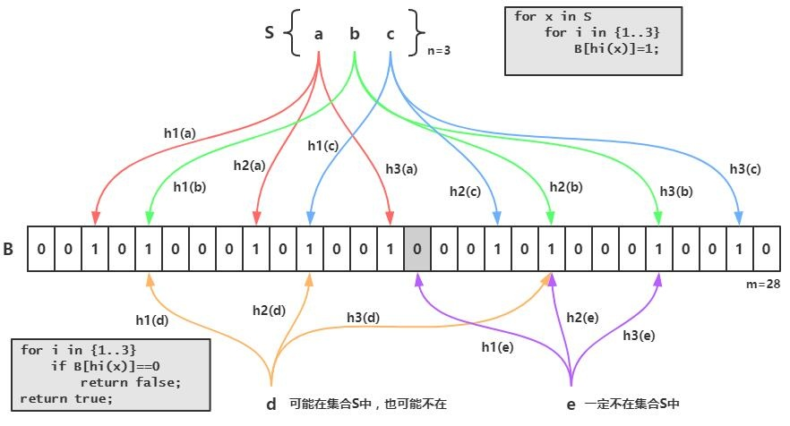
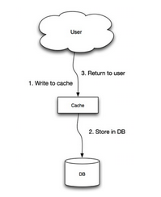

[toc]

# Redis

## Redis基本数据结构

String、Hash、List、Set、SortedSet。

HyperLogLog、GeoHash、Pub/Sub、还有Redis Module，比如Bloom Filter、Redis Search、Redis-ML。

### String

```c
struct sdshdr{
 int len;
 int free;
 char buf[];
}
```

#### SDS与C字符串的区别

1. 计数方式不同

2. 杜绝缓冲区溢出

3. 减少修改字符串时带来的内存重分配次数

   - 空间预分配
   - 惰性空间释放

4. 二进制安全

### Hash

[Redis—5种基本数据结构](https://mp.weixin.qq.com/s/MT1tB2_7f5RuOxKhuEm1vQ)

### List

### HyperLogLog

不精确的去重计数，标准误差0.81%。类似set。

```bash
pfadd uv username  # 增加计数，像set的sadd
pfcount uv         # 获取计数，就像set的scard
```

`pfmerge`指令可以将多个pf计数值累加形成新的pf值。

HyperLogLog结构需要占据12KB存储空间。

### Bloom Filter

#### Bloom Filter概念

布隆过滤器（Bloom Filter）可以用于检索一个元素是否在一个集合中。它的优点是空间效率和查询时间都远远超过一般的算法，缺点是有一定的误识别率和删除困难。

***面试关联：一般都会在回答缓存穿透，或者海量数据去重这个时候引出来。***

#### Bloom Filter原理

 布隆过滤器的原理是，当一个元素被加入集合时，通过K个散列函数将这个元素映射成一个位数组中的K个点，把它们置为1。检索时，我们只要看看这些点是不是都是1就（大约）知道集合中有没有它了：如果这些点有任何一个0，则被检元素一定不在；如果都是1，则被检元素很可能在。这就是布隆过滤器的基本思想。

Bloom Filter跟单哈希函数Bit-Map不同之处在于：Bloom Filter使用了k个哈希函数，每个字符串跟k个bit对应。从而降低了冲突的概率。

 

简单的说一下就是我们先把我们数据库的数据都加载到我们的过滤器中，比如数据库的id现在有：1、2、3

那就用id：1 为例子他在上图中经过三次hash之后，把三次原本值0的地方改为1

下次我进来查询如果id也是1 那我就把1拿去三次hash 发现跟上面的三个位置完全一样，那就能证明过滤器中有1的

反之如果不一样就说明不存在了

那应用的场景在哪里呢？一般我们都会用来防止缓存击穿（如果不知道缓存击穿是啥的小伙伴不要着急，我已经帮你准备好了，传送门 ↓ ）

简单来说就是你数据库的id都是1开始然后自增的，那我知道你接口是通过id查询的，我就拿负数去查询，这个时候，会发现缓存里面没这个数据，我又去数据库查也没有，一个请求这样，100个，1000个，10000个呢？你的DB基本上就扛不住了，如果在缓存里面加上这个，是不是就不存在了，你判断没这个数据就不去查了，直接return一个数据为空不就好了嘛。

这玩意这么好使那有啥缺点么？有的，我们接着往下看

#### Bloom Filter的缺点

bloom filter之所以能做到在时间和空间上的效率比较高，是因为牺牲了判断的准确率、删除的便利性

- 存在误判，可能要查到的元素并没有在容器中，但是hash之后得到的k个位置上值都是1。如果bloom filter中存储的是黑名单，那么可以通过建立一个白名单来存储可能会误判的元素。

- 删除困难。一个放入容器的元素映射到bit数组的k个位置上是1，删除的时候不能简单的直接置为0，可能会影响其他元素的判断。可以采用*Counting Bloom Filter*。

#### Bloom Filter 实现

布隆过滤器有许多实现与优化，Guava中就提供了一种Bloom Filter的实现。

 在使用bloom filter时，绕不过的两点是预估数据量n以及期望的误判率fpp，

 在实现bloom filter时，绕不过的两点就是hash函数的选取以及bit数组的大小。

 对于一个确定的场景，我们预估要存的数据量为n，期望的误判率为fpp，然后需要计算我们需要的Bit数组的大小m，以及hash函数的个数k，并选择hash函数

##### Bit数组大小选择

根据预估数据量n以及误判率fpp，bit数组大小的m的计算方式：

##### 哈希函数选择

​由预估数据量n以及bit数组长度m，可以得到一个hash函数的个数k：

​哈希函数的选择对性能的影响应该是很大的，一个好的哈希函数要能近似等概率的将字符串映射到各个Bit。选择k个不同的哈希函数比较麻烦，一种简单的方法是选择一个哈希函数，然后送入k个不同的参数。

 哈希函数个数k、位数组大小m、加入的字符串数量n的关系可以参考[Bloom Filters - the math](http://pages.cs.wisc.edu/~cao/papers/summary-cache/node8.html)，[Bloom_filter-wikipedia](https://en.wikipedia.org/wiki/Bloom_filter)

要使用BloomFilter，需要引入guava包：

```java
 <dependency>
            <groupId>com.google.guava</groupId>
            <artifactId>guava</artifactId>
            <version>23.0</version>
 </dependency>
```

测试分两步：

1. 往过滤器中放一百万个数，然后去验证这一百万个数是否能通过过滤器

2. 另外找一万个数，去检验漏网之鱼的数量

```java
/**
 * 测试布隆过滤器(可用于redis缓存穿透)
 */
public class TestBloomFilter {

    private static int total = 1000000;
    private static BloomFilter<Integer> bf = BloomFilter.create(Funnels.integerFunnel(), total);
//    private static BloomFilter<Integer> bf = BloomFilter.create(Funnels.integerFunnel(), total, 0.001);

    public static void main(String[] args) {
        // 初始化1000000条数据到过滤器中
        for (int i = 0; i < total; i++) {
            bf.put(i);
        }

        // 匹配已在过滤器中的值，是否有匹配不上的
        for (int i = 0; i < total; i++) {
            if (!bf.mightContain(i)) {
                System.out.println("有坏人逃脱了~~~");
            }
        }

        // 匹配不在过滤器中的10000个值，有多少匹配出来
        int count = 0;
        for (int i = total; i < total + 10000; i++) {
            if (bf.mightContain(i)) {
                count++;
            }
        }
        System.out.println("误伤的数量：" + count);
    }

}
```

运行结果：


运行结果表示，遍历这一百万个在过滤器中的数时，都被识别出来了。一万个不在过滤器中的数，误伤了320个，错误率是0.03左右。

看下BloomFilter的源码：

```java
public static <T> BloomFilter<T> create(Funnel<? super T> funnel, int expectedInsertions) {
        return create(funnel, (long) expectedInsertions);
    }  

public static <T> BloomFilter<T> create(Funnel<? super T> funnel, long expectedInsertions) {
    return create(funnel, expectedInsertions, 0.03); // FYI, for 3%, we always get 5 hash functions
}

public static <T> BloomFilter<T> create(
        Funnel<? super T> funnel, long expectedInsertions, double fpp) {
    return create(funnel, expectedInsertions, fpp, BloomFilterStrategies.MURMUR128_MITZ_64);
}

static <T> BloomFilter<T> create(
    Funnel<? super T> funnel, long expectedInsertions, double fpp, Strategy strategy) {
    ......
}
```

BloomFilter一共四个create方法，不过最终都是走向第四个。看一下每个参数的含义：

- funnel：数据类型(一般是调用Funnels工具类中的)

- expectedInsertions：期望插入的值的个数

- fpp 错误率(默认值为0.03)

- strategy 哈希算法(我也不懂啥意思)Bloom Filter的应用

在最后一个create方法中，设置一个断点：


上面的numBits，表示存一百万个int类型数字，需要的位数为7298440，700多万位。理论上存一百万个数，一个int是4字节32位，需要4*8*1000000=3200万位。如果使用HashMap去存，按HashMap50%的存储效率，需要6400万位。可以看出BloomFilter的存储空间很小，只有HashMap的1/10左右

上面的numHashFunctions，表示需要5个函数去存这些数字

使用第三个create方法，我们设置下错误率：

```java
private static BloomFilter<Integer> bf = BloomFilter.create(Funnels.integerFunnel(), total, 0.0003);
```

再运行看看：


此时误伤的数量为4，错误率为0.04%左右。


当错误率设为0.0003时，所需要的位数为16883499，1600万位，需要12个函数

和上面对比可以看出，错误率越大，所需空间和时间越小，错误率越小，所需空间和时间约大。

常见的几个应用场景：

- cerberus在收集监控数据的时候, 有的系统的监控项量会很大, 需要检查一个监控项的名字是否已经被记录到db过了, 如果没有的话就需要写入db.

- 爬虫过滤已抓到的url就不再抓，可用bloom filter过滤

- 垃圾邮件过滤。如果用哈希表，每存储一亿个 email地址，就需要 1.6GB的内存（用哈希表实现的具体办法是将每一个 email地址对应成一个八字节的信息指纹，然后将这些信息指纹存入哈希表，由于哈希表的存储效率一般只有 50%，因此一个 email地址需要占用十六个字节。一亿个地址大约要 1.6GB，即十六亿字节的内存）。因此存贮几十亿个邮件地址可能需要上百 GB的内存。而Bloom Filter只需要哈希表 1/8到 1/4 的大小就能解决同样的问题。

## Redis使用场景

1. 缓存
2. 会话缓存
3. 时效性
4. 访问频率
5. 计数器
6. 社交列表
7. 记录用户判定信息
8. 交集、并集和差集
9. 热门列表与排行榜
10. 最新动态
11. 消息队列

## 基本数据结构的使用场景

### String

最简单的类型，就是普通的 set 和 get，做简单的 KV 缓存。

- 缓存功能：String字符串是最常用的数据类型。

- 计数器：使用Redis作为系统的实时计数器，可以快速实现计数和查询的功能。最终的数据结果可以按照特定的时间落地到数据库或者其它存储介质当中进行永久保存。

- 共享用户Session：用户重新刷新一次界面，可能需要访问一下数据进行重新登录，或者访问页面缓存Cookie，但是可以利用Redis将用户的Session集中管理，在这种模式只需要保证Redis的高可用，每次用户Session的更新和获取都可以快速完成。大大提高效率。

### Hash

可以将结构化的数据，比如一个对象（前提是这个对象没嵌套其他的对象）给缓存在 Redis 里。

### List

- 消息队列：Redis的链表结构，可以轻松实现阻塞队列，可以使用左进右出的命令组成来完成队列的设计。比如：数据的生产者可以通过lpush命令从左边插入数据，多个数据消费者，可以使用brpop命令阻塞的“抢”列表尾部的数据。

- 文章列表或者数据分页展示的应用。

### Set

Set是无序集合，会自动去重的。交集、并集、差集。

### Sorted Set

Sorted Set 是排序的 Set，去重但可以排序，写进去的时候给一个分数，自动根据分数排序。

- 排行榜：有序集合经典使用场景。

- 用Sorted Sets来做带权重的队列，比如普通消息的score为1，重要消息的score为2，然后工作线程可以选择按score的倒序来获取工作任务。让重要的任务优先执行。


## 查找固定前缀的key

使用`keys`指令可以扫出指定模式的key列表。时间复杂度是O(n)，Redis的单线程的。keys指令会导致线程阻塞一段时间，线上服务会停顿，直到指令执行完毕，服务才能恢复。

### 使用`scan`指令

scan指令可以无阻塞的提取出指定模式的key列表，但是会有一定的重复概率，在客户端做一次去重就可以了，但是整体所花费的时间会比直接用keys指令长。

scan是增量式迭代命令，在对键进行增量式迭代的过程中，键可能会被修改，所以增量式迭代命令只能对被返回的元素提供有限的保证。

## Redis分布式锁

将setnx和expire组合在一起的原子指令。

```bash
set lock:name true ex 5 nx

del lock:name
```

### 多个系统并发操作Redis带来的数据问题

系统A、B、C三个系统，分别去操作Redis的同一个Key，本来顺序是1，2，3是正常的，但是因为系统A网络突然抖动了一下，B，C在他前面操作了Redis，这样数据不就错了么。


## Redis做异步队列

使用list结构作为队列，rpush生产消息，lpop消费消息。当lpop没有消息的时候，要适当sleep一会再重试。

list还有个指令叫blpop，在没有消息的时候，它会阻塞住直到消息到来。

使用Pub/Sub主题订阅者模式，可以实现1:N的消息队列。但是在消费者下线的情况下，生产的消息会丢失。

## Redis实现延时队列

使用zset，拿时间戳作为score，消息内容作为key调用zadd来生产消息，消费者用`zrangebyscore`指令获取N秒之前的数据轮询进行处理。

## Redis持久化

服务器重启的时候先把RDB的数据全部读进去，但是他可能不完整，你再回放一下AOF日志。不过Redis本身的机制是如果AOF持久化开启且存在AOF文件时，优先加载AOF文件；AOF关闭或者AOF文件不存在时，加载RDB文件；加载AOF/RDB文件城后，Redis启动成功；AOF/RDB文件存在错误时，Redis启动失败并打印错误信息。

### RDB

RDB做镜像全量持久化，因为RDB会耗费较长时间，不够实时，在停机的时候会导致大量丢失数据，所以需要AOF来配合使用。

RDB的原理，fork和cow。fork是指redis通过创建子进程来进行RDB操作，cow指的是copy on write，子进程创建后，父子进程共享数据段，父进程继续提供读写服务，写脏的页面数据会逐渐和子进程分离开来。

### AOF

AOF是增量持久化方式，AOF日志存储的是Redis服务器的顺序指令序列，只记录对内存进行修改的指令记录。Redis先执行指令才将日志存盘。

配置AOF日志sync属性，如果不要求性能，在每条写指令时都sync一下磁盘，就不会丢失数据。但是在高性能的要求下每次都sync是不现实的，一般都使用定时sync，比如1s一次，这个时候最多就会丢失1s的数据。

可以用`bgrewriteaof`指令对AOF日志进行重写瘦身。

### RDB和AOF的对比

#### RDB优点

RDB对Redis的性能影响非常小，是因为在同步数据的时候他只是fork了一个子进程去做持久化的，而且他在数据恢复的时候速度比AOF来的快，适合做冷备。

#### RDB缺点

RDB都是快照文件，都是默认五分钟甚至更久的时间才会生成一次，这意味着你这次同步到下次同步这中间五分钟的数据都很可能全部**丢失**掉。

RDB在生成数据快照的时候，如果文件很大，客户端可能会暂停几毫秒甚至几秒。

#### AOF优点

AOF是一秒一次去通过一个后台的线程fsync操作，那最多丢这一秒的数据。

AOF的日志是通过一个叫非常可读的方式记录的，这样的特性就适合做灾难性数据误删除的紧急恢复。

#### AOF缺点

一样的数据，AOF文件比RDB还要大。

AOF开启后，Redis支持写的QPS会比RDB支持写的要低，这是因为它每秒都要去异步刷新一次日志fsync，当然即使这样性能还是很高。

### 混合持久化

...

## Redis管道Pipeline

可以将多次IO往返的时间缩减为一次，前提是pipeline执行的指令之间没有因果相关性。

使用redis-benchmark进行压测的时候可以发现影响redis的QPS峰值的一个重要因素是pipeline批次指令的数目。

## Redis同步机制

Redis可以使用主从同步，从从同步。

第一次同步时，主节点做一次`bgsave`，并同时将后续修改操作记录到内存buffer，待完成后将RDB文件全量同步到复制节点，复制节点接受完成后将RDB镜像加载到内存。

加载完成后，再通知主节点将期间修改的操作记录同步到复制节点进行重放就完成了同步过程。后续的增量数据通过AOF日志同步即可，有点类似数据库的binlog。

CAP（一致性、可用性、分区容忍性）原理，Redis主从数据是异步同步的，不满足一致性，满足可用性，并保证最终一致性。

可以用`wait`指令变成同步复制，等待节点同步完成，确保系统的强一致性。

## Redis集群

### Redis Sentinal

Redis Sentinal 着眼于高可用，在master宕机时会自动将slave提升为master，继续提供服务。Sentinel无法保证消息完全不丢失，但是也能尽量保证消息少丢失。

```bash
min-slaves-to-write 1 # 主节点至少有一个从节点在进行正常复制，否者停止对外写服务
min-slaves-max-lag 10 # 如果10s内没有收到从节点反馈，就认为从节点不正常
```

哨兵组件的主要功能：

- 集群监控：负责监控 Redis master 和 slave 进程是否正常工作。

- 消息通知：如果某个 Redis 实例有故障，那么哨兵负责发送消息作为报警通知给管理员。

- 故障转移：如果 master node 挂掉了，会自动转移到 slave node 上。

- 配置中心：如果故障转移发生了，通知 client 客户端新的 master 地址。

### Redis Cluster

Redis Cluster 着眼于扩展性，在单个redis内存不足时，使用Cluster进行分片存储。

## 缓存雪崩

同一时间大面积失效，那一瞬间Redis跟没有一样。

那这个数量级别的请求直接打到数据库几乎是灾难性的，你想想如果打挂的是一个用户服务的库，那其他依赖他的库所有的接口几乎都会报错，如果没做熔断等策略基本上就是瞬间挂一片的节奏。

解决：在批量往Redis存数据的时候，把每个Key的失效时间都加个随机值就好了，这样可以保证数据不会在同一时间大面积失效。

## 缓存穿透和击穿

### 缓存穿透

缓存穿透是指缓存和数据库中都没有的数据，而用户不断发起请求，我们数据库的 id 都是1开始自增上去的，如发起为id值为 -1 的数据或 id 为特别大不存在的数据。这时的用户很可能是攻击者，攻击会导致数据库压力过大，严重会击垮数据库。

解决：1. 接口层增加校验，比如用户鉴权校验，参数做校验，不合法的参数直接代码Return，比如：id 做基础校验，id <=0的直接拦截等。2. 正常用户是不会在单秒内发起这么多次请求的，网关层Nginx有配置项，可以让运维对单个IP每秒访问次数超出阈值的IP都拉黑。

布隆过滤器（Bloom Filter）这个也能很好的防止缓存穿透的发生，它的原理就是利用高效的数据结构和算法快速判断出你这个Key是否在数据库中存在，不存在你return就好了，存在你就去查了DB刷新KV再return。

### 缓存击穿

缓存击穿跟缓存雪崩有点像，但是又有一点不一样，缓存雪崩是因为大面积的缓存失效，打崩了DB，而缓存击穿是指一个Key非常热点，在不停的扛着大并发，大并发集中对这一个点进行访问，当这个Key在失效的瞬间，持续的大并发就穿破缓存，直接请求数据库。

## Redis过期策略

### 定期删除

默认100ms就随机抽一些设置了过期时间的key，去检查是否过期，过期了就删了。

### 惰性删除

等你来查询了我看看你过期没，过期就删了还不给你返回，没过期该怎么样就怎么样。

## 内存淘汰机制

- no-eviction:当内存达到限制并且客户端尝试执行会让更多内存被使用的命令（大部分的写入指令，DEL例外），返回错误。

- allkeys-lru: 尝试回收最少使用的键（LRU），使得新添加的数据有空间存放。

- volatile-lru: 尝试回收最少使用的键（LRU），但仅限于在过期集合的键,使得新添加的数据有空间存放。

- allkeys-random: 回收随机的键使得新添加的数据有空间存放。

- volatile-random: 回收随机的键使得新添加的数据有空间存放，但仅限于在过期集合的键。

- volatile-ttl: 回收在过期集合的键，并且优先回收存活时间（TTL）较短的键，使得新添加的数据有空间存放。

如果没有键满足回收的前提条件的话，策略volatile-lru, volatile-random以及volatile-ttl就和noeviction 差不多了。

使用真实的LRU实现是因为这需要太多的内存，不过近似的LRU算法对于应用而言应该是等价的。

## 缓存与数据库双写一致性问题（缓存更新策略）

### Cache Aside 模式

这是大家经常用到的一种策略模式。这种模式主要流程如下：

- 应用在查询数据的时候，先从缓存Cache中读取数据，如果缓存中没有，则再从数据库中读取数据，得到数据库的数据之后，将这个数据也放到缓存Cache中。
- 如果应用要更新某个数据，也是先去更新数据库中的数据，更新完成之后，则通过指令让缓存Cache中的数据失效。

#### 为什么删除缓存而不是接着更新缓存

如果你频繁修改一个缓存涉及的多个表，缓存也频繁更新。但是问题在于，这个缓存到底会不会被频繁访问到吗？用到缓存才去算缓存。其实删除缓存，而不是更新缓存，就是一个 Lazy 计算的思想，不要每次都重新做复杂的计算，不管它会不会用到，而是让它到需要被使用的时候再重新计算。

同时2个写操作，在并发的情况下会导致脏数据：

虽然 Cache Aside 模式在极端情况下也可能会产生脏数据，不过这种概率比上面一种概率要小很多。所以整体而言 Cache Aside 模式 还是一种比较简单实用的方式。

#### 为什么先更新数据库

因为缓存在数据持久化这方面往往没有数据库做得好，而且数据库中的数据是不存在过期这个概念的，我们应当以数据库中的数据为主，缓存因为有着过期时间这一概念，最终一定会跟数据库保持一致。

### Read/Write Through 模式



这个模式其实就是将 缓存服务 作为主要的存储，应用的所有读写请求都是直接与缓存服务打交道，而不管最后端的数据库了，数据库的数据由缓存服务来维护和更新。不过缓存中数据变更的时候是同步去更新数据库的，在应用的眼中只有缓存服务。流程就相当简单了：

- 应用要读数据和更新数据都直接访问缓存服务
- 缓存服务同步的将数据更新到数据库

这个模式出现脏数据的概率就比较低，但是就强依赖缓存了，对缓存服务的稳定性有较大要求，另外，增加新缓存节点时还会有初始状态空数据问题。

### Write Behind 模式

这个模式就是 Read/Write Through 模式 的一个变种。区别就是 Read/Write Through 模式的缓存写数据库的时候是同步的，而 Write Behind 模式 的缓存操作数据库是异步的。流程如下：

- 应用要读数据和更新数据都直接访问缓存服务
- 缓存服务异步的将数据更新到数据库（通过异步任务）

这个模式的特点就是速度很快，效率会非常高，但是数据的一致性比较差，还可能会有数据的丢失情况，实现逻辑也较为复杂。

### 读请求和写请求串行化实现强一致性

读请求和写请求串行化，串到一个内存队列里去。

串行化可以保证一定不会出现不一致的情况，但是它也会导致系统的吞吐量大幅度降低，用比正常情况下多几倍的机器去支撑线上的一个请求。

相当于读写锁，读读可以并发执行，但有写操作在执行的话，其他任务就要阻塞等待。

### 引入消息队列异步删除缓存

解决删除缓存失败导致的数据不一致问题。

考虑到网络问题导致的执行失败或执行顺序的问题，这里要进行的删除操作应当是异步延时操作。

具体来说就是参考前面说的，引入消息队列，在删除缓存失败的情况下，将删除缓存作为一条消息写入消息队列，然后由消费端进行慢慢的消费和重试。

## Redis的线程模型

Redis 内部使用文件事件处理器 file event handler，这个文件事件处理器是单线程的，所以 Redis 才叫做单线程的模型。它采用 IO 多路复用机制同时监听多个 Socket，根据 Socket 上的事件来选择对应的事件处理器进行处理。

文件事件处理器的结构包含 4 个部分：

- 多个Socket

- IO多路复用程序

- 文件事件分派器

- 事件处理器（连接应答处理器、命令请求处理器、命令回复处理器）

多个 Socket 可能会并发产生不同的操作，每个操作对应不同的文件事件，但是 IO 多路复用程序会监听多个 Socket，会将 Socket 产生的事件放入队列中排队，事件分派器每次从队列中取出一个事件，把该事件交给对应的事件处理器进行处理。

### 为什么Redis单线程却能支撑高并发

1. 基于纯内存的操作，读写速度较高；

2. 核心是基于非阻塞的IO多路复用机制；

3. 单线程反而避免了多线程的频繁的上下文的切换问题。

## Redis常见性能问题和解决方案

1. Master AOF持久化，如果不重写AOF文件，这个持久化方式对性能的影响是最小的，但是AOF文件会不断增大，AOF文件过大会影响Master重启的恢复速度。

2. Master调用`bgrewriteaof`重写AOF文件，AOF在重写的时候会占大量的CPU和内存资源，导致服务load过高，出现短暂服务暂停现象。

3. 避免在压力较大的主库上增加从库，要结合主从同步和从从同步，减轻主节点的同步负担。

## Redis的key如何寻址

Redis 服务器在初始化时，默认的会预先分配 16 个数据库。 这其中的每一个数据库，都由一个 redisDb 的结构存储。 redisDb 的结构中有两个重要的部分：

- redisDb.id： 存储着 redis 数据库以整数表示的号码；
- redisDb.dict： 存储着该库所有的键值对数据；
- redisDb.expires： 保存着每一个键的过期时间。

针对 Redis 中的众多数据库，使用 select number 选择数据库时。

Redis 的字典使用哈希表作为其底层实现。 dict 类型使用的两个指向哈希表的指针，其中 0 号哈希表 ht[0] 主要用于存储数据库的所有键值，而 1 号哈希表主要用于程序对 0 号哈希表进行 rehash 时使用，rehash 一般是在添加新值时会触发。 所以 redis 中查找一个 key，其实就是对进行该 dict 结构中的 ht[0] 进行查找操作。

## 分布式寻址算法

[分布式寻址算法](https://www.cnblogs.com/hello-shf/p/12079986.html)

## 为什么需要缓存

在项目中，最消耗性能的地方就是后端服务的数据库了。而数据库的读写频率常常都是不均匀分布的，大多情况是读多写少，并且读操作（select）还会有一些复杂的判断条件，比如 like、group、join 等等，这些语法是非常消耗性能的，所有会出现很多的慢查询，因此数据库很容易在读操作的环节遇到瓶颈。

那么通过在数据库前面，前置一个缓存服务，就可以有效的吸收不均匀的请求，抵挡流量波峰。

另外，如果应用与数据源不在同一个服务器的情况下，中间还会有很多的网络消耗，也会对应用的响应速度有很大影响，如果当前应用对数据实时性的要求不那么强的话，在应用侧加上缓存就能很快速的提升效率。

## 使用缓存会遇到哪些问题

### 数据一致性问题

使用缓存之后，就相当于把数据存放了2份，一份是在数据库中，另一份存放在缓存中。当有新的数据要写入或者旧数据需要更新的时候，如果我们只更新了其中一份数据源，**那两边的数据就不一致了，所以这里就存在一个缓存数据与数据库数据如何进行有效且快速的同步问题，才可以保证数据的最终一致性。**

### 缓存的过期时间问题

设计缓存的过期时间需要非常的有技巧，且必须与业务实际情况相结合。因为如果设计的过期时间太短了，那会导致缓存效果不佳，且还会造成频繁的从数据库中往缓存里写数据。如果缓存设计的过期时间太长了，又会导致内存的浪费。

### 缓存的命中率问题

这也是设计缓存中需要存放哪些数据的很重要一点，如果设计的不好，可能会导致缓存命中率过低，失去缓存效果。一般对于热点数据而言，要保证命中率达到70%以上效果最佳。

### 缓存的穿透/雪崩问题

是指如果缓存服务一旦宕机或全部丢失，那么有可能一瞬间所有的流量都直接打到了后端数据库上，可能会造成连锁反应，瞬间的请求高峰极有可能导致数据库无法承载。


