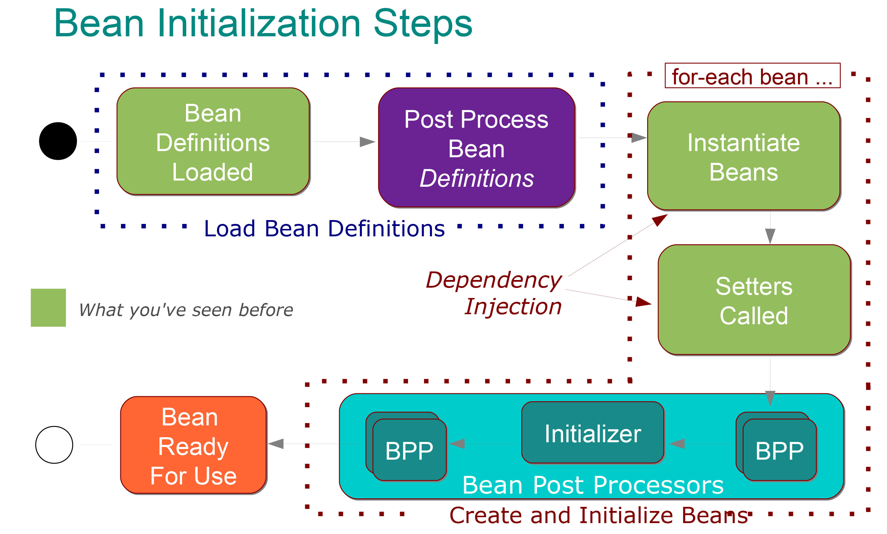

# Spring

## 三级缓存

- 一级缓存：singletonObjects，单例池，Spring容器；

- 二级缓存：singletonFactories，存的是bean工厂；

- 三级缓存：earlySingletonObjects，存的是还没有真正变成bean的对象。

一级缓存singletonObjects叫做单例池，里面存的是**bean**，而三级缓存earlySingletonObjects存的是**对象**，只有一个对象完整的经历了bean的生命周期变成一个bean之后才会被存到一级缓存中。

二级缓存是包装bean的工厂类，里面有大量的后置处理器要执行，为了提高性能，所以设计了三级缓存。

**循环引用**：单例对象之间的循环引用，只能是在单例的情况下才会出现，一个原型对象是不会产生循环引用的。

**循环引用过程**：创建A的时候会判断是否有循环依赖（是否正在被创建，beanName会被放到一个list里面），如果有的话会放到二级缓存bean工厂中，然后再注入B对象，B对象也经历一遍bean生命周期，注入A对象，这时候就从二级缓存拿出bean工厂得到A对象，将A对象放入三级缓存中。二级缓存的bean工厂来实现AOP代理（bean工厂是通过后置处理器产生bean）

**Spring容器**：BeanFactory、beanDefinitionMap、三级缓存、Spring后置处理器等等，这些组件组成的Spring容器，而不只是单例池。

## Bean的生命周期



1. Spring容器初始化，`AbstractApplicationContext.refresh();`;

2. 开始实例化单例类，`AbstractApplicationContext.finishBeanFactoryInitialization(beanFactory);`;

3. 实例化所有单例且非lazy的bean，`beanFactory.preInstantiateSingletons();`;

4. 开始实例化普通的bean，`AbstractBeanFactory.getBean();`，`AbstractBeanFactory.doGetBean();`；

5. `DefaultSingletonBeanRegistry.getSingleton(beanName);`，第一次调用`getSingleton()`返回为空；

6. `AbstractAutowireCapableBeanFactory.createBean(beanName, mbd, args);`；

7. `AbstractAutowireCapableBeanFactory.doCreateBean(beanName, mbdToUse, args);`，真正实例化对象是里面的`AbstractAutowireCapableBeanFactory.createBeanInstance(beanName, mbd, args);`；

8. `AbstractAutowireCapableBeanFactory.populateBean(beanName, mbd, instanceWrapper);`，属性注入；

9. `AbstractAutowireCapableBeanFactory.initializeBean(beanName, exposedObject, mbd);`，Spring回调执行初始化方法初始化bean，这个方法里面`AbstractAutowireCapableBeanFactory.applyBeanPostProcessorsBeforeInitialization(wrappedBean, beanName);`先执行Spring中的内置处理器`xxxPostProcessor`，也就是`@PostConstruct`注释的方法，然后再`AbstractAutowireCapableBeanFactory.invokeInitMethods(beanName, wrappedBean, mbd);`执行接口（`afterPropertiesSet()`方法）和XML初始化方法（init-method定制的初始化方法）。

## 监听器

## Spring容器初始化过程

[Spring容器IOC初始化过程--今天终于进行总结了](https://juejin.im/post/6844903581678600206)

### 各模块简介

1. Resource模块，就是资源，用于对所有资源xml、txt、property等文件资源的抽象。策略模式

2. ResourceLoader组件，该组件负责对Spring资源的加载，资源指的是xml、properties等文件资源，返回一个对应类型的Resource对象。

3. 首先配置文件中的`<bean/>`标签跟我们的BeanDefinition是一一对应的，`<bean>`元素标签拥有class、scope、lazy-init等配置属性，BeanDefinition则提供了相应的beanClass、scope、lazyInit属性。

4. Spring通过BeanDefinition将配置文件中的`<bean>`配置信息转换为容器的内部表示，并将这些BeanDefiniton注册到BeanDefinitonRegistry中。Spring容器的BeanDefinitionRegistry就像是Spring配置信息的内存数据库，主要是以map的形式保存，后续操作直接从BeanDefinitionRegistry中读取配置信息。一般情况下，BeanDefinition只在容器启动时加载并解析，除非容器刷新或重启，这些信息不会发生变化，当然如果用户有特殊的需求，也可以通过编程的方式在运行期调整BeanDefinition的定义。

5. Resource资源是怎么转成我们的BeanDefinition的呢?因此就引入了BeanDefinitionReader组件，Reader嘛！就是一种读取机制。

6. 既然要保存注册这些bean,那肯定要有个数据结构充当容器，就是一个Map，就在BeanDefinitionRegistry的一个实现类SimpleBeanDefinitionRegistry里的ConcurrentHashMap。

7. 前面说的5个点基本上可以看出ApplicationContext上下文基本直接或间接贯穿所有的部分，因此我们一般称之为容器，除此之外，ApplicationContext还拥有除了bean容器这种角色外，还包括了获取整个程序运行的环境参数等信息（比如JDK版本，jre等），其实这部分Spring也做了对应的封装，称之为Enviroment。

### 初始化过程


1. `super(parent)`，AbstractApplicationContext的构造方法，里面就只是设置了一个`resourcePatternResolver`，它是继承了ResourceLoader的结构。

2. `setConfigLocation(configLocations)`，解析给定的资源路径，必要时用相应的环境属性值替换占位符，应用于资源路径配置。当前环境由`getEnvironment()`方法获取Environment。

3. 重头戏`refresh()`，`synchronized (this.startupShutdownMonitor)`进入同步代码块，执行以下模板方法过程：

   1. `prepareRefresh();`，设置启动时间，是否激活标识位，初始化属性源(property source)配置。

   2. `obtainFreshBeanFactory();`，创建beanFactory，根据XML为每个bean生成BeanDefinition，然后注册到生成的beanFactory：

      - `refreshBeanFactory();`，刷新Bean工厂，如果已经存在Bean工厂，那就关闭并销毁，再创建一个新的bean工厂。
         - 创建的过程中设置容器参数、开启注解自动装配。
         - `loadBeanDefinitions(beanFactory);`，将所有BeanDefinition载入beanFactory中，此处依旧是模板方法，具体由子类实现。主要是用BeanDefinitionReader读取并解析资源。
      - 返回创建的beanFactory。

   3. `prepareBeanFactory(beanFactory);`，为beanFactory设置准备事项：
      - 设置bean类加载器
      - 设置Spring语言表达式（SpEL）解析器
      - 扫描ApplicationContextAware bean
      - 注册类加载期类型切面织入（AOP）LoadTimeWeaver
      - 为各种加载进入beanFactory的bean配置默认环境
  
   4. `postProcessBeanFactory(beanFactory)`，模板方法，由子类来提供具体的实现。子类可以有自己的特殊对BeanDefinition后处理方法。比如修改某个bean的id/name属性、scope属性、lazy-init属性等。

   5. `invokeBeanFactoryPostProcessors(beanFactory)`，该方法调用所有的BeanFactoryPostProcessor的postProcessBeanFactory()方法。这是个接口由开发者来对生成的BeanDefinition做处理，由开发者提供处理逻辑。

   6. `registerBeanPostProcessors(beanFactory);`，注册所有实现了BeanPostProcessor接口的Bean。

   7. 初始化消息处理源，初始化容器事件，注册bean监听器到事件传播器上。

   8. `finishBeanFactoryInitialization(beanFactory);`，初始化所有的单例非懒加载的bean。

   9. `finishRefresh();`，初始化容器的生命周期事件处理器，并发布容器的生命周期事件。

### Bean的初始化过程

1. BeanDefinition解析：调用容器中InstantiationAwareBeanPostProcessor的postProcessBeforeInstantiation()方法，可以在Bean实例化前修改BeanDefinition。
2. 实例化：将指定的BeanDefinition转换成BeanWrapper，然后调用createBeanInstance创建Bean的实例。Bean的实例化有多种策略，如工厂方法、指定参数构造器和默认无参构造器等。总之，createBeanInstance()方法会返回一个刚实例化好的、属性未赋值的空Bean。
3. 属性填充：调用populateBean()方法，为Bean进行属性的赋值和依赖的注入。
4. 属性填充后置处理：调用容器中InstantiationAwareBeanPostProcessor的postProcessAfterInstantiation()方法，进行属性填充后处理。
5. 初始化前置处理：调用BeanPostProcessor的postProcessBeforeInitialization()方法进行初始化前置处理。
6. 初始化：调用Bean的初始化方法，顺序为：InitializingBean的afterPropertiesSet() -> 注册的init-method。
7. 初始化后置处理：调用BeanPostProcessor的postProcessAfterInitialization()执行初始化后置处理。
8. 调用registerDisposableBeanIfNecessary()方法，注册Bean的销毁处理逻辑：将所有实现了DisposableBean接口的或者注册了destroy-method方法的Bean,封装成一个DisposableBean,将其销毁的回调注册到容器中。

#### 源码角度

getBean(beanName);

doGetBean(name, null, null, false);

Object sharedInstance = getSingleton(beanName); 提前check一下，这时候还是null

if (parentBeanFactory != null && !containsBeanDefinition(beanName)) {...}  判断是不是在父工厂里，如果是那就到父工厂中getBean()。

this.alreadyCreated.add(beanName); 放到一个set里，标记至少已经被创建一次。

String[] dependsOn = mbd.getDependsOn();  初始化bean的依赖，将这些依赖注册到bean依赖的Map里，对依赖调用getBean(dep)

```java
sharedInstance = getSingleton(beanName, () -> {
   try {
      return createBean(beanName, mbd, args);
   }
   catch (BeansException ex) {
      destroySingleton(beanName);
      throw ex;
   }
});
```

再次执行`getSingleton(String beanName, ObjectFactory<?> singletonFactory)`，传入一个只有一句`createBean(beanName, mbd, args);`的ObjectFactory。

这里`this.singletonObjects.get(beanName);`查找singletonObjects缓存里有没有。

`beforeSingletonCreation(beanName);`里执行`this.singletonsCurrentlyInCreation.add(beanName)`标记该beanName正在被创建。

`singletonObject = singletonFactory.getObject();`调用传进来的singletonFactory，创建对象，就是前面的`createBean(beanName, mbd, args);`。这个方法里创建bean实例、注入依赖、执行post-processors。

`resolveBeforeInstantiation(beanName, mbdToUse);`给BeanPostProcessors一个返回代理而不是目标bean实例的机会，如果这里生产代理实例就直接返回了。`bean = applyBeanPostProcessorsBeforeInstantiation(targetType, beanName);`这里就是执行`InstantiationAwareBeanPostProcessor`类型的BPP，这里有挺多这个类型的子类型的BPP，但是都是返回null了，可能是这些BPP执行的时机不对。如果这里返回了一个bean实例，会执行所有的BPP的postProcessAfterInitialization()方法后再返回。

`doCreateBean(beanName, mbdToUse, args);`，`createBeanInstance(beanName, mbd, args);`，这里选择一个合适的实例化策略，工厂方法、构造函数自动装配或简单实例化。最后没什么特别的就选择无参构造`BeanWrapper instantiateBean(final String beanName, final RootBeanDefinition mbd)`。

`beanInstance = getInstantiationStrategy().instantiate(mbd, beanName, parent);`，这里拿到的是默认的`new CglibSubclassingInstantiationStrategy()`CGLIB子类实例化策略。instantiate()内部调用`BeanUtils.instantiateClass(constructorToUse);`。这里会`!bd.hasMethodOverrides()`先判断有没有方法重写，如果有的话就用CGLIB方式，如果没有就是普通的反射方式创建实例`ctor.newInstance(argsWithDefaultValues);`。

将创建的beanInstance放到一个BeanWrapper包装类里面返回，这里算实例化完了。退出createBeanInstance()方法。

从instanceWrapper中拿到bean和beanType。然后执行`MergedBeanDefinitionPostProcessor.postProcessMergedBeanDefinition()`允许后处理程序修改合并后的beanDefinition。会给`mbd.postProcessed = true;`标记beanDefinition已后处理。

接下来就是提前缓存单例，以便解决循环引用，`addSingletonFactory(beanName, () -> getEarlyBeanReference(beanName, mbd, bean));`，这里将一个只有一句getEarlyBeanReference()方法的工厂放进singletonFactories缓存里。这个方法里就是所有对应类型的BPP执行`SmartInstantiationAwareBeanPostProcessor.getEarlyBeanReference(exposedObject, beanName);`。

初始化bean实例。执行`populateBean(beanName, mbd, instanceWrapper);`，先执行`InstantiationAwareBeanPostProcessor.postProcessAfterInstantiation()`，这里就是在属性设置之前给BPP机会来修改bean的状态。再执行根据名字和类型注入属性的Autowire。接下来又是执行`InstantiationAwareBeanPostProcessor.postProcessProperties()`，`AutowiredAnnotationBeanPostProcessor`，`metadata.inject(bean, beanName, pvs);`，`element.inject(target, beanName, pvs);`注入AutoWired注解的属性，解析依赖，`doResolveDependency()`，`descriptor.resolveCandidate(autowiredBeanName, type, this);`里面执行`beanFactory.getBean(beanName);`，这里就是执行bean y的生命周期了，同样经过上面的流程走到`doResolveDependency()`这一步然后去getBean("x")；然后`this.singletonFactories.get(beanName);`从缓存中拿到那个的单例工厂，执行工厂的getObject()方法，里面就是执行上面的`getEarlyBeanReference()`，里面执行`SmartInstantiationAwareBeanPostProcessor.getEarlyBeanReference(exposedObject, beanName);`。然后拿到singletonObject，`this.earlySingletonObjects.put(beanName, singletonObject);`，同时将这个的单例工厂从工厂缓存中删除。这样就拿回了bean "x"。然后注册依赖，就是添加到`Map<String, Set<String>> dependenciesForBeanMap`。这里还是y的生命周期，不过已经注入了x，当y的创建完成以后，x的生命周期也是到了注入y的这一步，所以下面的过程对于这两个bean是一样的。

`initializeBean()`初始化，执行所有BPP的`postProcessBeforeInitialization()`，这里会执行`@PostConstruct`，然后执行InitializingBean接口（`afterPropertiesSet()`方法）和init-method定制的初始化方法。

将bean放到singletonObjects缓存里，并从singletonFactories、earlySingletonObjects中移除，也将beanName保存在一个registeredSingletons有序Set里。返回bean。

## Spring事务失效

1. Transactional注解标注方法修饰符为非public时，@Transactional注解将会不起作用。

2. 在类内部调用调用类内部@Transactional标注的方法。

3. 事务方法内部捕捉了异常，没有抛出新的异常，导致事务操作不会进行回滚。
