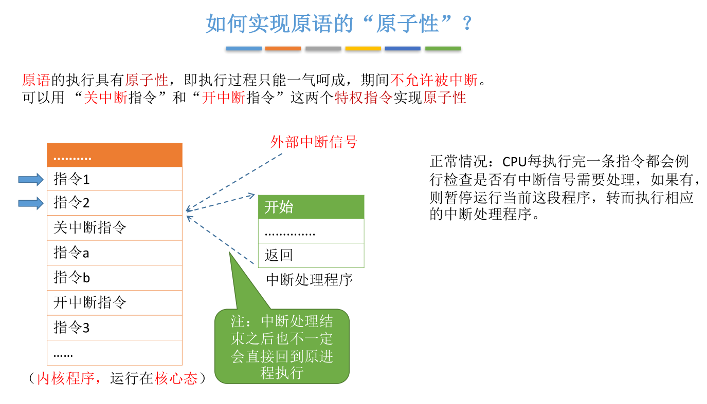
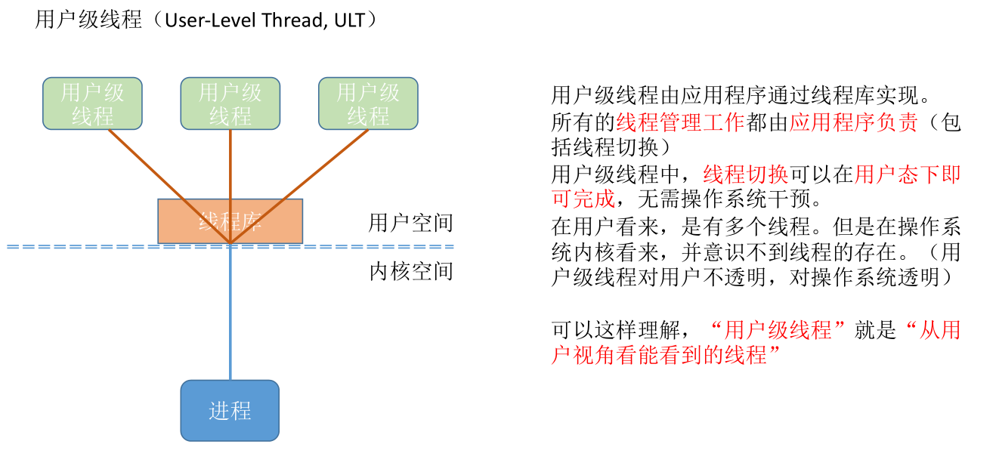

[toc]

# 操作系统

## OS运行机制与体系结构

操作系统核心态和用户态，对应执行的是特权指令和非特权指令。内核态和用户态是用系统中程序状态字（PSW）标志位来表示状态的。

## 中断

中断：利用中断机制，实现多道程序并发执行。中断的本质是发生中断就意味着需要操作系统介入，开展管理工作。**中断**是让操作系统内核夺回CPU使用权的唯一途径。

当发生中断，CPU收到计时部件发出的中断信号，切换为**内核态**对中断进行处理，将CPU的使用权限交给操作系统，操作系统内核对中断信号进行处理，操作系统收到中断信号是刚刚的时间片已到，然后切换另一个进程投入运行，接下来这个进程就会在用户态下运行。

输入输出这只能通过系统调用（发出内中断信号）请求操作系统执行，然后CPU切换到内核态执行操作。

**用户态 -> 核心态**是通过中断实现的，并且中断是唯一途径。

**核心态 -> 用户态**的切换是通过执行一个特权指令，将程序转态字（PSW）的标志位设置为用户态。

### 中断的分类

## 系统调用

应用程序通过**系统调用**请求操作系统的服务。而系统中的各种共享资源都由操作系统内核统一掌管，因此**凡是与共享资源有关的操作（如存储分配、I/O操作、文件管理等），都必须通过系统调用的方式向操作系统内核提出服务请求**，由操作系统内核代为完成。这样**可以保证系统的稳定性和安全性**，防止用户进行非法操作。系统调用会是处理器从用户态进入核心态。

系统调用的过程：传递系统调用参数 -> 执行陷入指令（用户态） -> 执行相应的内请求核程序处理系统调用（核心态） -> 返回应用程序

注意：

1. 陷入指令是在用户态执行的，执行陷入指令之后立即引发一个内中断，使CPU进入核心态；
2. 陷入指令也是唯一一个只能在用户态执行而不能在核心态执行的指令；
3. 发出系统调用请求是在用户态，而对系统调用的相应处理在核心态下进行。

## 进程

### 进程实体的组成

### 进程的组织方式

### 进程的特征

### 进程的状态

### 进程状态的转换

### 如何实现进程控制

在进程状态转换过程中，都要修改PCB中的数据，为了防止修改PCB数据发生错误，就需要这些操作具有原子性，那么就要用操作系统中的**原语**。

### 如何实现原语的原子性

### 进程控制相关的原语

进程控制会导致进程状态的转换。无论哪个进程控制原语，要做的无非三类事情：

1. 更新PCB中的信息
   1. 所有的进程控制原语一定都会修改进程状态标志
   2. 剥夺当前运行进程的CPU使用权必然需要保存其运行环境
   3. 某进程开始运行前必然要恢复期运行环境
2. 将PCB插入合适的队列
3. 分配/回收资源

#### 原语分类

- 创建原语（进程创建）

- 撤销原语（进程的终止，kill 杀进程）

- 阻塞原语和唤醒原语（成对使用，进程因为什么事件被阻塞又是因为什么事件被唤醒）

- 切换原语（进程的切换，会是一个进程 运行态 -> 阻塞态/就绪态 -> 运行态）

### 进程通信

...

### 进程同步

...

## 线程

线程是一个基本的CPU执行单元，也是程序执行流的最小单位。各线程之间也可以并发，从而进一步提升了并发度。引入线程后，进程只作为除CPU之外的系统资源的分配单元。

### 引入线程带来的变化

### 线程的属性

### 线程的实现方式

#### 用户级线程（User-Level Thread, ULT）

#### 内核级线程（Kernel-Level Thread, KLT, 又称“内核支持的线程”）

#### 二者组合的方式

### 多线程模型

#### 多对一

#### 一对一

#### 多对多

#### 线程与多线程模型总结

## 处理机调度

### 进程挂起态和七状态模型

### 三层调度的联系和对比

### 进程调度

#### 进程调度的时机

由上述进程是主动放弃处理机还是被动放弃处理机引入下面的进程的调度方式。

#### 进程调度的方式

#### 调度算法

##### 先来先服务（FCFS, First Come First Serve）

##### 短作业优先（SJF, Shortest Job First）

##### 高响应比优先（ HRRN, Highest Response Ratio Next）

##### 时间片轮转（RR, Round-Robin）

##### 多级反馈队列

##### 调度算法对比

## 内存管理

### 内存的基础知识

### 内存管理的概念

# Linux

1. Linux 指令知道哪些？

2. 进程之间的通信方式？

   管道/匿名管道、有名管道、信号、消息队列、共享内存、信号量、Socket

[Linux IO模式及 select、poll、epoll详解](https://segmentfault.com/a/1190000003063859)

## 进程阻塞和挂起

