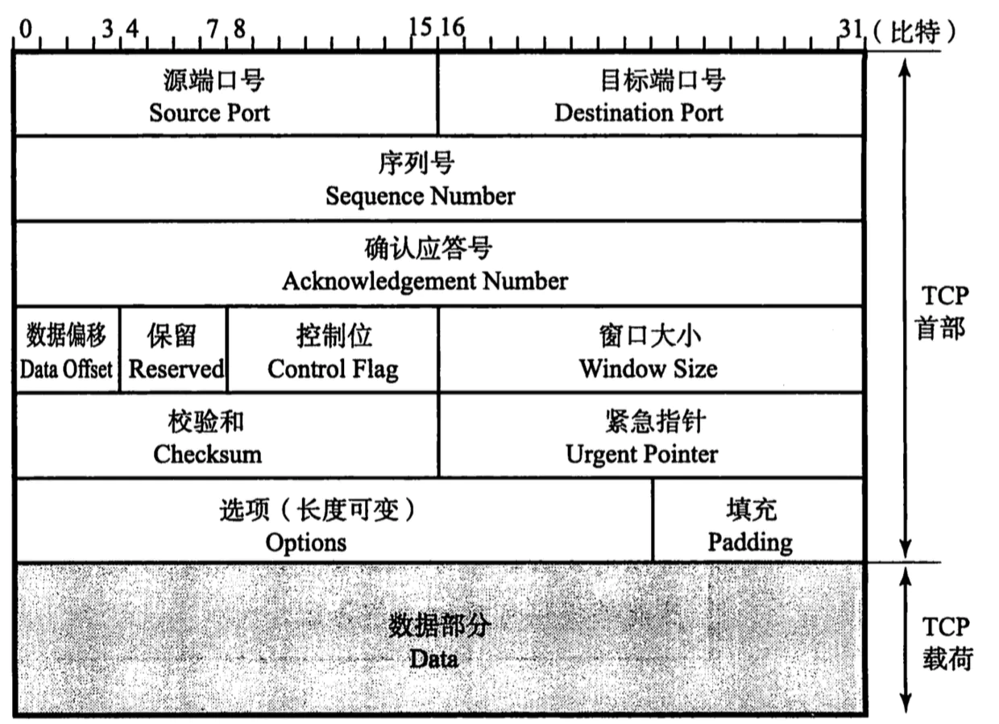
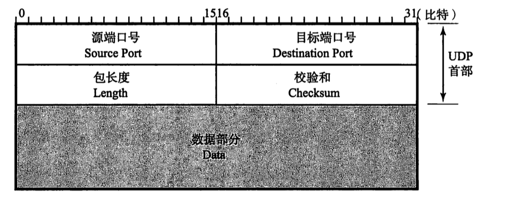
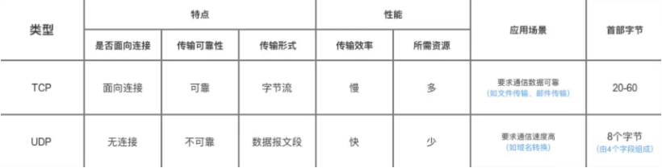
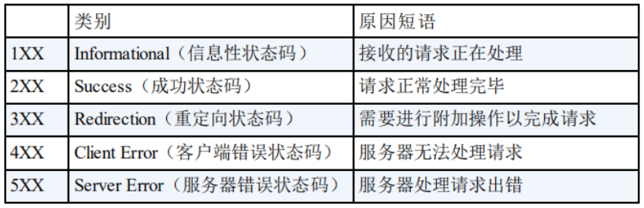
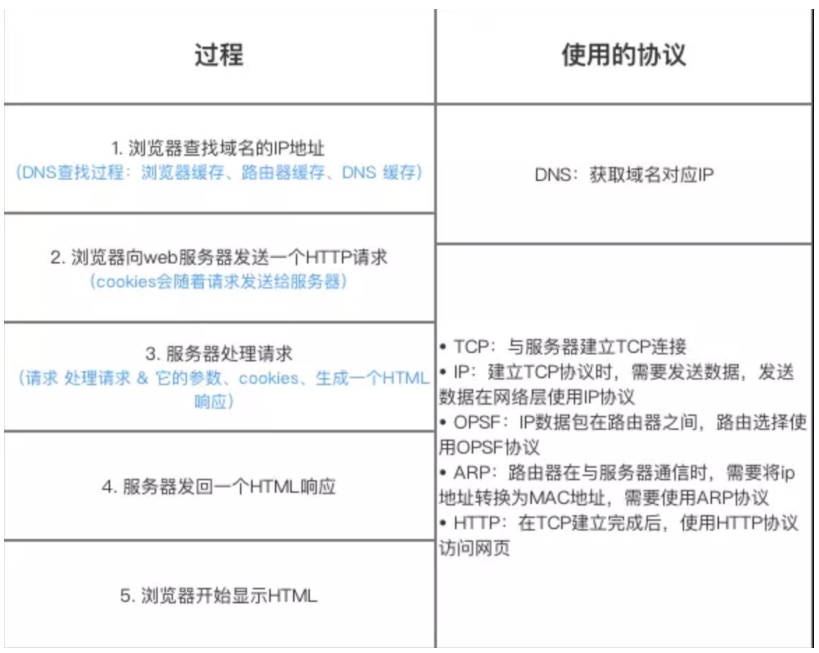

[toc]

# 概述

## OSI 与 TCP/IP各层的结构与功能，都有哪些协议

OSI 七层协议（自底向上）：物理层、数据链路层、网络层、运输层、会话层、表示层、应用层

# TCP与UDP

## TCP

### TCP的概述

TCP把连接作为最基本的对象，每一条TCP连接都有两个端点，这种端点我们叫作套接字（socket），它的定义为端口号拼接到IP地址即构成了套接字，例如，若IP地址为192.3.4.16 而端口号为80，那么得到的套接字为192.3.4.16:80。

### TCP报文首部

1. 源端口和目的端口，各占2个字节，分别写入源端口和目的端口；

2. 序列号，占4个字节，TCP连接中传送的字节流中的每个字节都按顺序编号。例如，一段报文的序号字段值是 301 ，而携带的数据共有100字段，显然下一个报文段（如果还有的话）的数据序号应该从401开始；

3. 确认号，占4个字节，是期望收到对方下一个报文的第一个数据字节的序号。例如，B收到了A发送过来的报文，其序列号字段是501，而数据长度是200字节，这表明B正确的收到了A发送的到序号700为止的数据。因此，B期望收到A的下一个数据序号是701，于是B在发送给A的确认报文段中把确认号置为701；

4. 数据偏移，占4位，它指出TCP报文的数据距离TCP报文段的起始处有多远；

5. 保留，占6位，保留今后使用，但目前应都位0；
6. 控制位：改字段长度为 8 比特，分别有 8 个控制标志。依次是 CWR，ECE，URG，ACK，PSH，RST，SYN 和 FIN：

    1. 紧急URG，当URG=1，表明紧急指针字段有效。告诉系统此报文段中有紧急数据；

    2. 确认ACK，仅当ACK=1时，确认号字段才有效。TCP规定，在连接建立后所有报文的传输都必须把ACK置1；

    3. 推送PSH，当两个应用进程进行交互式通信时，有时在一端的应用进程希望在键入一个命令后立即就能收到对方的响应，这时候就将PSH=1；

    4. 复位RST，当RST=1，表明TCP连接中出现严重差错，必须释放连接，然后再重新建立连接；

    5. 同步SYN，在连接建立时用来同步序号。当SYN=1，ACK=0，表明是连接请求报文，若同意连接，则响应报文中应该使SYN=1，ACK=1；

    6. 终止FIN，用来释放连接。当FIN=1，表明此报文的发送方的数据已经发送完毕，并且要求释放；

7. 窗口大小，占2字节，指的是通知接收方，发送本报文你需要有多大的空间来接受；

8. 检验和，占2字节，校验首部和数据这两部分；

9. 紧急指针，占2字节，指出本报文段中的紧急数据的字节数；

10. 选项，长度可变，定义一些其他的可选的参数。

### TCP 三次握手

最开始的时候客户端和服务器都是处于CLOSED状态。主动打开连接的为客户端，被动打开连接的是服务器。

1. TCP服务器进程先创建传输控制块TCB，时刻准备接受客户进程的连接请求，此时服务器就进入了LISTEN（监听）状态；

2. TCP客户进程也是先创建传输控制块TCB，然后向服务器发出连接请求报文，这是报文首部中的同部位SYN=1，同时选择一个初始序列号 seq=x ，此时，TCP客户端进程进入了 SYN-SENT（同步已发送状态）状态。TCP规定，SYN报文段（SYN=1的报文段）不能携带数据，但需要消耗掉一个序号。

3. TCP服务器收到请求报文后，如果同意连接，则发出确认报文。确认报文中应该 ACK=1，SYN=1，确认号是ack=x+1，同时也要为自己初始化一个序列号 seq=y，此时，TCP服务器进程进入了SYN-RCVD（同步收到）状态。这个报文也不能携带数据，但是同样要消耗一个序号。

4. TCP客户进程收到确认后，还要向服务器给出确认。确认报文的ACK=1，ack=y+1，自己的序列号seq=x+1，此时，TCP连接建立，客户端进入ESTABLISHED（已建立连接）状态。TCP规定，ACK报文段可以携带数据，但是如果不携带数据则不消耗序号。

5. 当服务器收到客户端的确认后也进入ESTABLISHED状态，此后双方就可以开始通信了。

注意：先创建控制块、状态转换、消不消耗序列号、能不能携带数据

### 为什么TCP客户端最后还要发送一次确认呢

三次握⼿的⽬的是建⽴可靠的通信信道，就是双方都确认自己和对方的发送和接收是正常的。

第⼀次握⼿：Client 什么都不能确认；Server 确认了对⽅发送正常，⾃⼰接收正常；

第⼆次握⼿：Client 确认了⾃⼰发送、接收正常，对⽅发送、接收正常；Server 确认了对⽅发送正常，⾃⼰接收正常；

第三次握⼿：Client 确认了⾃⼰发送、接收正常，对⽅发送、接收正常；Server 确认了⾃⼰发送、接收正常，对⽅发送、接收正常；

所以三次握⼿就能确认双发收发功能都正常，缺⼀不可。

主要防止已经失效的连接请求报文突然又传送到了服务器，从而产生错误。

场景：如果使用的是两次握手建立连接，客户端发送了第一个请求连接并且没有丢失，只是因为在网络结点中滞留的时间太长了，TCP的客户端迟迟没有收到确认报文，会重新向服务器发送请求，此后客户端和服务器经过两次握手完成连接，传输数据，然后关闭连接。之后滞留的那一次请求如果到达服务器，就又会两次握手建立连接，这样会导致错误和资源浪费。

### ACK 确认包丢失怎么办

三次握手其实解决了第二步的数据包丢失问题。那么第三步的 ACK 确认丢失后，TCP 协议是如何处理的呢？

按照 TCP 协议处理丢包的一般方法，服务端会重新向客户端发送数据包，直至收到 ACK 确认为止。但实际上这种做法有可能遭到 SYN 泛洪攻击。所谓的泛洪攻击，是指发送方伪造多个 IP 地址，模拟三次握手的过程。当服务器返回 ACK 后，攻击方故意不确认，从而使得服务器不断重发 ACK。由于服务器长时间处于半连接状态，最后消耗过多的 CPU 和内存资源导致死机。

正确处理方法是服务端发送 RST 报文，进入 CLOSE 状态。这个 RST 数据包的 TCP 首部中，控制位中的 RST 位被设置为 1。这表示连接信息全部被初始化，原有的 TCP 通信不能继续进行。客户端如果还想重新建立 TCP 连接，就必须重新开始第一次握手。

### TCP 四次挥手

数据传输完毕后，双方都可释放连接。最开始的时候，客户端和服务器都是处于ESTABLISHED状态，然后客户端主动关闭，服务器被动关闭。

1. 客户端进程发出连接释放报文，并且停止发送数据。释放数据报文首部，FIN=1，其序列号为seq=u（等于前面已经传送过来的数据的最后一个字节的序号加1），此时，客户端进入FIN-WAIT-1（终止等待1）状态。 TCP规定，FIN报文段即使不携带数据，也要消耗一个序号。

2. 服务器收到连接释放报文，发出确认报文，ACK=1，ack=u+1，并且带上自己的序列号seq=v，此时，服务端就进入了CLOSE-WAIT（关闭等待）状态。TCP服务器通知高层的应用进程，客户端向服务器的方向就释放了，这时候处于半关闭状态，即客户端已经没有数据要发送了，但是服务器若发送数据，客户端依然要接受。这个状态还要持续一段时间，也就是整个CLOSE-WAIT状态持续的时间。

3. 客户端收到服务器的确认请求后，此时，客户端就进入FIN-WAIT-2（终止等待2）状态，等待服务器发送连接释放报文（在这之前还需要接受服务器发送的最后的数据）。

4. 服务器将最后的数据发送完毕后，就向客户端发送连接释放报文，FIN=1，ack=u+1，由于在半关闭状态，服务器很可能又发送了一些数据，假定此时的序列号为seq=w，此时，服务器就进入了LAST-ACK（最后确认）状态，等待客户端的确认。

5. 客户端收到服务器的连接释放报文后，必须发出确认，ACK=1，ack=w+1，而自己的序列号是seq=u+1，此时，客户端就进入了TIME-WAIT（时间等待）状态。注意此时TCP连接还没有释放，必须经过2*MSL（最长报文段寿命）的时间后，当客户端撤销相应的TCB后，才进入CLOSED状态。

6. 服务器只要收到了客户端发出的确认，立即进入CLOSED状态。同样，撤销TCB后，就结束了这次的TCP连接。可以看到，服务器结束TCP连接的时间要比客户端早一些。

### 为什么客户端最后还要等待2个MSL

MSL（Maximum Segment Lifetime），TCP允许不同的实现可以设置不同的MSL值。

第一，保证客户端发送的最后一个ACK报文能够到达服务器，因为这个ACK报文可能丢失，站在服务器的角度看来，我已经发送了FIN+ACK报文请求断开了，客户端还没有给我回应，应该是我发送的请求断开报文它没有收到，于是服务器又会重新发送一次，而客户端就能在这个2MSL时间段内收到这个重传的报文，接着给出回应报文，并且会重启2MSL计时器。

第二，防止类似与“三次握手”中提到了的“已经失效的连接请求报文段”出现在本连接中。客户端发送完最后一个确认报文后，在这个2MSL时间中，就可以使本连接持续的时间内所产生的所有报文段都从网络中消失。这样新的连接中不会出现旧连接的请求报文。

### 关闭连接的最后一个 ACK 丢失怎么办

实际上，在第三步中，客户端收到 FIN 包时，它会设置一个计时器，等待相当长的一段时间。如果客户端返回的 ACK 丢失，那么服务端还会重发 FIN 并重置计时器。假设在计时器失效前服务器重发的 FIN 包没有到达客户端，客户端就会进入 CLOSE 状态，从而导致服务端永远无法收到 ACK 确认，也就无法关闭连接。

### 为什么建立连接是三次握手，关闭连接确是四次挥手呢

建立连接的时候， 服务器在LISTEN状态下，收到建立连接请求的SYN报文后，把ACK和SYN放在一个报文里发送给客户端。

而关闭连接时，服务器收到对方的FIN报文时，仅仅表示对方不再发送数据了但是还能接收数据，而自己也未必全部数据都发送给对方了，所以己方可以立即关闭，也可以发送一些数据给对方后，再发送FIN报文给对方来表示同意现在关闭连接，因此，己方ACK和FIN一般都会分开发送，从而导致多了一次。

### 如果已经建立了连接，但是客户端突然出现故障了怎么办

TCP 还设有一个保活计时器，显然，客户端如果出现故障，服务器不能一直等下去，白白浪费资源。服务器每收到一次客户端的请求后都会重新复位这个计时器，时间通常是设置为2小时，若两小时还没有收到客户端的任何数据，服务器就会发送一个探测报文段，以后每隔75秒发送一次。若一连发送10个探测报文仍然没反应，服务器就认为客户端出了故障，接着就关闭连接。

## UDP协议

 1. UDP是一个非连接的协议，传输数据之前源端和终端不建立连接，当它想传送时就简单地去抓取来自应用程序的数据，并尽可能快地把它扔到网络上。在发送端，UDP传送数据的速度仅仅是受应用程序生成数据的速度、计算机的能力和传输带宽的限制；在接收端，UDP把每个消息段放在队列中，应用程序每次从队列中读一个消息段。

 2. 由于传输数据不建立连接，因此也就不需要维护连接状态，包括收发状态等，因此一台服务机可同时向多个客户机传输相同的消息。

 3. UDP信息包的标题很短，只有8个字节，相对于TCP的20个字节信息包的额外开销很小。

 4. 吞吐量不受拥挤控制算法的调节，只受应用软件生成数据的速率、传输带宽、源端和终端主机性能的限制。

 5. UDP使用尽最大努力交付，即不保证可靠交付，因此主机不需要维持复杂的链接状态表（这里面有许多参数）。

 6. UDP是面向报文的。发送方的UDP对应用程序交下来的报文，在添加首部后就向下交付给IP层。既不拆分，也不合并，而是保留这些报文的边界，因此，应用程序需要选择合适的报文大小。

### UDP首部

UDP 协议最大的特点就是简单，校验和用来判断数据在传输过程中是否损坏。

### UDP的应用场景

1. 面向数据报方式
2. 网络数据大多为短消息
3. 拥有大量Client
4. 对数据安全性无特殊要求
5. 网络负担非常重，但对响应速度要求高

## TCP和UDP的区别

1. 基于连接与无连接；
2. 对系统资源的要求（TCP较多，UDP少）；
3. UDP程序结构较简单；
4. 流模式与数据报模式；
5. TCP保证数据正确性，UDP可能丢包；
6. TCP保证数据顺序，UDP不保证。

## 具体编程时的区别

1. socket()的参数不同
2. UDP Server不需要调用listen和accept
3. UDP收发数据用sendto/recvfrom函数
4. TCP：地址信息在connect/accept时确定
5. UDP：在sendto/recvfrom函数中每次均 需指定地址信息
6. UDP：shutdown函数无效

## TCP 协议如何保证可靠传输

[TCP 协议如何保证可靠传输](https://www.cnblogs.com/deliver/p/5471231.html)

1. 应⽤数据被分割成 TCP 认为最适合发送的数据块。
2. TCP 给发送的每⼀个包进⾏编号，接收⽅对数据包进⾏排序，把有序数据传送给应⽤层。
3. 校验和： TCP 将保持它⾸部和数据的检验和。这是⼀个端到端的检验和，⽬的是检测数据在传输过程中的任何变化。如果收到段的检验和有差错，TCP 将丢弃这个报⽂段和不确认收到此报⽂段。
4. TCP 的接收端会丢弃重复的数据。
5. 流量控制： TCP 连接的每⼀⽅都有固定⼤⼩的缓冲空间，TCP的接收端只允许发送端发送接收端缓冲区能接纳的数据。当接收⽅来不及处理发送⽅的数据，能提示发送⽅降低发送的速率，防⽌包丢失。TCP 使⽤的流量控制协议是可变⼤⼩的滑动窗⼝协议。（TCP 利⽤滑动窗⼝实现流量控制）
6. 拥塞控制：当⽹络拥塞时，减少数据的发送。为了进⾏拥塞控制，TCP 发送⽅要维持⼀个 拥塞窗⼝(cwnd) 的状态变量。拥塞控制窗⼝的⼤⼩取决于⽹络的拥塞程度，并且动态变化。发送⽅让⾃⼰的发送窗⼝取为拥塞窗⼝和接收⽅的接受窗⼝中较⼩的⼀个。慢开始、拥塞避免、快重传和快恢复。
7. ARQ协议：⾃动重传请求（Automatic Repeat-reQuest，ARQ）是OSI模型中数据链路层和传输层的错误纠正协议之⼀。它通过使⽤确认和超时这两个机制，在不可靠服务的基础上实现可靠的信息传输。如果发送⽅在发送后⼀段时间之内没有收到确认帧，它通常会重新发送。ARQ包括停⽌等待ARQ协议和连续ARQ协议，拥有错误检测（Error Detection）、正面确认（Positive Acknowledgment）、超时重传（Retransmission after Timeout）和 负面确认及重传（Negative Acknowledgment and Retransmission）等机制。

## DDoS 攻击与防御

 [DDoS 攻击与防御](https://mp.weixin.qq.com/s?__biz=MzI3MTI2NzkxMA==&mid=2247486202&idx=1&sn=a8394ebb01078de971ec405aeacf08fa)

# HTTP

[可能是全网最全的http面试答案](https://juejin.im/post/5d032b77e51d45777a126183)

[天下无难试之HTTP协议面试刁难大全](https://zhuanlan.zhihu.com/p/34354434)

## GET与POST的区别

[99%的人理解错 HTTP 中 GET 与 POST 的区别](https://www.oschina.net/news/77354/http-get-post-different)

1. GET在浏览器回退时是无害的，而POST会再次提交请求。

2. GET请求会被浏览器主动cache，而POST不会，除非手动设置。

3. GET请求参数会被完整保留在浏览器历史记录里，而POST中的参数不会被保留。

4. GET产生的URL地址可以被Bookmark，而POST不可以。

5. GET请求在URL中传送的参数是有长度限制的，而POST没有。

6. 对参数的数据类型，GET只接受ASCII字符，而POST没有限制。

7. GET比POST更不安全，因为参数直接暴露在URL上，所以不能用来传递敏感信息。

8. GET参数通过URL传递，POST放在Request body中。

## HTTP状态码

## 浏览器同源策略 *

[浏览器同源策略及跨域的解决方法](https://juejin.im/post/5ba1d4fe6fb9a05ce873d4ad)

## 跨域请求的解决方法

## HTTPS

HTTP + 加密 + 认证 + 完整性保护 = HTTPS

## 对称加密和非对称加密

## 加密算法 *

## SSL的过程

# IP *

# 综合性问题

## 在浏览器中输⼊URL地址到显示页面的过程 *

## CDN

## DNS的过程
